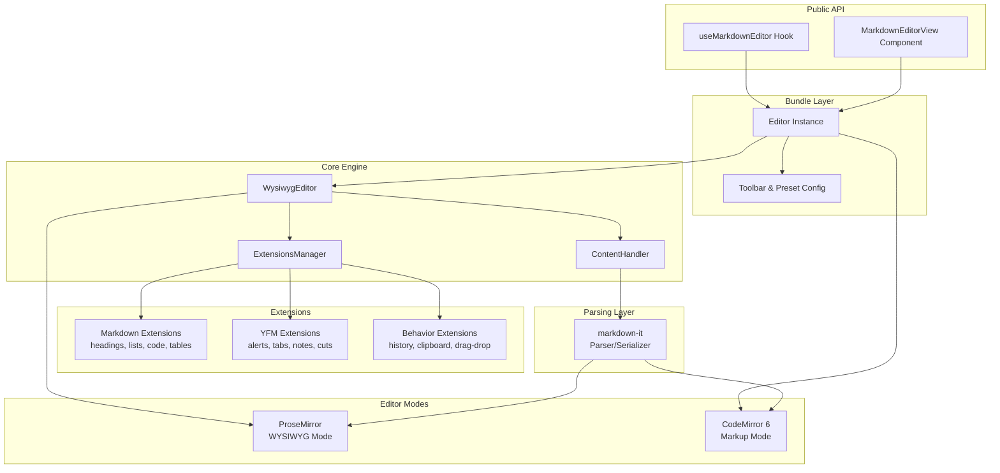
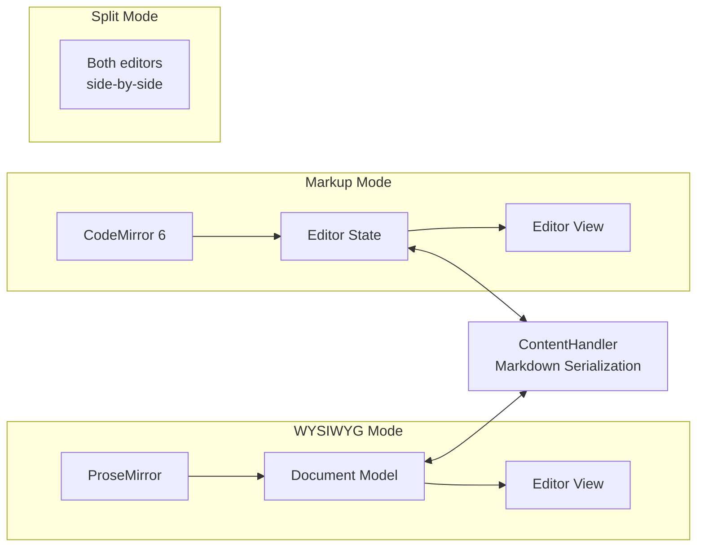
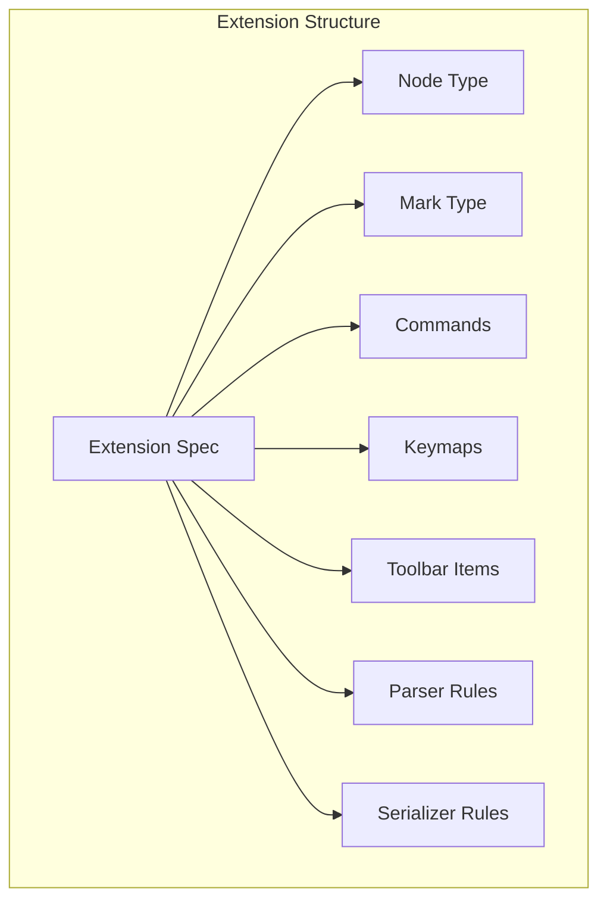
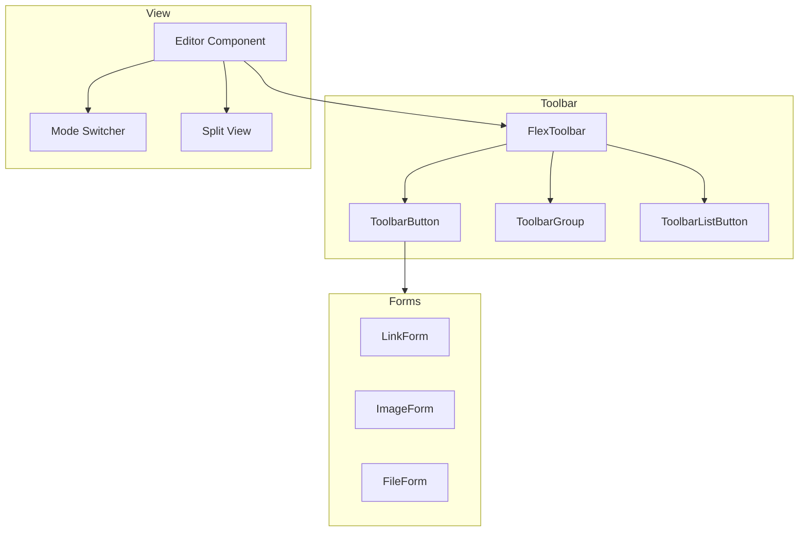
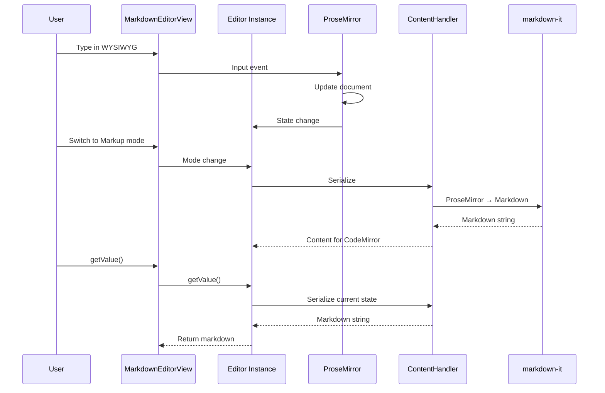

# Architecture Overview

This document describes the high-level architecture of @gravity-ui/markdown-editor.

## System Diagram



## Main Components

### 1. Public API (`/src/bundle`)

The consumer-facing React API:

| Export | Purpose |
|--------|---------|
| `useMarkdownEditor(options)` | Hook that creates and configures an editor instance |
| `MarkdownEditorView` | React component that renders the editor UI |
| `Editor` | Bundle-level editor class wrapping the core |

### 2. Core Engine (`/src/core`)

The heart of the editor:

| Component | Purpose |
|-----------|---------|
| `WysiwygEditor` | ProseMirror editor wrapper with state management |
| `ContentHandler` | Converts between Markdown ↔ ProseMirror document |
| `ExtensionBuilder` | Configures extensions during initialization |
| `ExtensionsManager` | Manages active extensions at runtime |

### 3. Editor Modes



| Mode | Engine | Description |
|------|--------|-------------|
| WYSIWYG | ProseMirror | Rich text editing with toolbar |
| Markup | CodeMirror 6 | Raw markdown with syntax highlighting |
| Split | Both | Side-by-side with synchronized content |

### 4. Extension System (`/src/extensions`)

Extensions are modular plugins that add functionality:



**Extension Categories:**

| Category | Location | Examples |
|----------|----------|----------|
| Markdown | `/extensions/markdown` | Heading, Bold, Italic, Link, Image, CodeBlock, Table |
| YFM | `/extensions/yfm` | Alerts (Note/Tip/Warning), Tabs, Cuts, File |
| Behavior | `/extensions/behavior` | History, Clipboard, Placeholder, Selection |
| Additional | `/extensions/additional` | HTML, LaTeX, Mermaid, GPT |

### 5. Presets (`/src/presets`)

Pre-configured extension bundles:

| Preset | Description |
|--------|-------------|
| `zero` | Minimal - just paragraphs and line breaks |
| `commonmark` | Standard CommonMark syntax |
| `default` | CommonMark + common extras |
| `yfm` | Yandex Flavored Markdown |
| `full` | All available extensions |

### 6. UI Components



## Data Flow

### Content Flow



### Event System

The editor emits events for external integration:

| Event | Trigger |
|-------|---------|
| `change` | Content modified |
| `submit` | Ctrl/Cmd+Enter pressed |
| `cancel` | Escape pressed |
| `toolbar-action` | Toolbar button clicked |
| `mode-change` | WYSIWYG ↔ Markup switch |

## Directory Structure

```
src/
├── bundle/           # Public React API
│   ├── Editor.ts
│   ├── useMarkdownEditor.ts
│   ├── MarkdownEditorView.tsx
│   └── config/       # Toolbar configurations
│
├── core/             # Editor engine
│   ├── Editor.ts     # WysiwygEditor
│   ├── ContentHandler.ts
│   ├── ExtensionBuilder.ts
│   ├── ExtensionsManager.ts
│   └── markdown/     # Parsing utilities
│
├── extensions/       # Plugin system
│   ├── base/         # Base implementations
│   ├── markdown/     # Standard markdown
│   ├── yfm/          # YFM-specific
│   ├── behavior/     # Editor behaviors
│   └── additional/   # Optional (HTML, LaTeX, etc.)
│
├── presets/          # Extension bundles
├── toolbar/          # Toolbar components
├── forms/            # Dialog components
├── view/             # React utilities
├── pm/               # ProseMirror re-exports
├── cm/               # CodeMirror re-exports
├── utils/            # Shared utilities
└── styles/           # SCSS stylesheets
```
