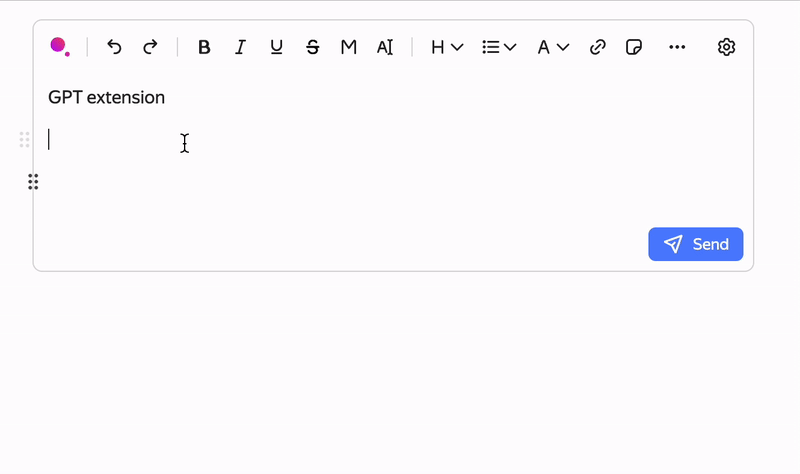

## How to connect GPT extensions to editor

First to integrate this extension, you need to use the following versions of the packages:

    @gravity-ui/markdown-editor version 13.18.0 or higher


Features:




### 1. Add extension usage and extensions props

```ts
import React from 'react';

import {
    gptExtension,
    MarkdownEditorView,
    useMarkdownEditor,
} from '@gravity-ui/markdown-editor';

export const Editor: React.FC<EditorProps> = (props) => {
    const mdEditor = useMarkdownEditor({
        // ...
        extraExtensions: (builder) =>
            builder.use(
                ...
                // add gpt extension
                gptExtension,
                // The next step we show implementation gptWidgetProps
                gptWidgetProps,
            ),
    });

    return <MarkdownEditorView
        ...
        editor={mdEditor}
    />
};         
```
### 2. Implementation ```gptWidgetProps```

```ts
import React from 'react';
import {type GptWidgetOptions} from '@gravity-ui/markdown-editor';

// Your function to implement GPT response
const gptRequestHandler = async ({
    markup,
    customPrompt,
    promptData,
}: {
    markup: string;
    customPrompt?: string;
    promptData: unknown;
}) => {
    await new Promise((resolve) => setTimeout(resolve, 1000));

    let gptResponseMarkup = markup;

    if (customPrompt) {
        gptResponseMarkup = markup + ` \`enhanced with ${customPrompt}\``;
    } else if (promptData === 'do-uno-reverse') {
        gptResponseMarkup = gptResponseMarkup.replace(/[\wа-яА-ЯёЁ]+/g, (match) =>
            match.split('').reverse().join(''),
        );
    } else if (promptData === 'do-shout-out') {
        gptResponseMarkup = gptResponseMarkup.toLocaleUpperCase();
    }

    return {
        rawText: gptResponseMarkup,
    };
};

function renderAnswer(data: {rawText: string}) {
    return <div>{data.rawText}</div>;
}

export const gptWidgetProps: GptWidgetOptions = {
    answerRender: renderAnswer,
    customPromptPlaceholder: 'Ask Yandex GPT to edit the text highlighted text',
    disabledPromptPlaceholder: 'Ask Yandex GPT to generate the text',
    gptAlertProps: {
        showedGptAlert: true,
        onCloseGptAlert: () => {},
    },
    promptPresets: [
        {
            hotKey: 'control+3',
            data: 'do-uno-reverse',
            display: 'Use the uno card',
            key: 'do-uno-reverse',
        },
        {
            hotKey: 'control+4',
            data: 'do-shout-out',
            display: 'Make the text flashy',
            key: 'do-shout-out',
        },
    ],
    onCustomPromptApply: async ({markup, customPrompt, promptData}) => {
        return gptRequestHandler({markup, customPrompt, promptData});
    },
    onPromptPresetClick: async ({markup, customPrompt, promptData}) => {
        return gptRequestHandler({markup, customPrompt, promptData});
    },
    onTryAgain: async ({markup, customPrompt, promptData}) => {
        return gptRequestHandler({markup, customPrompt, promptData});
    },
    onApplyResult: (markup) => {
        // add your callback for apply Gpt result text
        console.log(markup);
    },
    onUpdate: (event) => {
        if (event?.rawText) {
            // add your callback for any text updates
            console.log(event.rawText);
        }
    },
    onLike: async () => {}, // function to track feedback for good
    onDislike: async () => {}, // and bad Gpt answers
};          
```
### 3. Add extension to menubar and toolbar and command menu config for editor

Add in tool bar

```ts
import {
    ...
    wGptToolbarItem,
    wysiwygToolbarConfigs,
} from '@gravity-ui/markdown-editor';

import {cloneDeep} from '@gravity-ui/markdown-editor/_/lodash';

export const Editor: React.FC<EditorProps> = (props) => {
    ...
    const wToolbarConfig = cloneDeep(wysiwygToolbarConfigs.wToolbarConfig);
    wToolbarConfig.unshift([wGptToolbarItem]);

    ...

    return <MarkdownEditorView
        ...
        wysiwygToolbarConfig={wToolbarConfig}
        ...
    />
};
```
Add in menu bar

```ts
export const Editor: React.FC<EditorProps> = (props) => {
    ...
    const wSelectionMenuConfig = [[wGptToolbarItem], ...wysiwygToolbarConfigs.wSelectionMenuConfig];

    const mdEditor = useMarkdownEditor({
        ...
        extensionOptions: {
            selectionContext: {config: wSelectionMenuConfig},
        },
        ...
    })
    ...
};
```

Add in command menu config (/)

```ts
export const Editor: React.FC<EditorProps> = (props) => {
    ...
    const wCommandMenuConfig = wysiwygToolbarConfigs.wCommandMenuConfig // main commands
    wCommandMenuConfig.unshift(wysiwygToolbarConfigs.wGptItemData); // add gpt command

    const mdEditor = useMarkdownEditor({
        ...
        extensionOptions: {
            ...
            commandMenu: {actions: wCommandMenuConfig},
        },
    })
    ...
};
```
### 4. Done, You can use the extension!

Вelow is an example of all code in one place

```ts
import React from 'react';

import {
    gptExtension,
    MarkdownEditorView,
    wGptToolbarItem,
    wysiwygToolbarConfigs,
    useMarkdownEditor,
} from '@gravity-ui/markdown-editor';
import {cloneDeep} from '@gravity-ui/markdown-editor/_/lodash';

import {gptWidgetProps} from './gptWidgetProps';

export const Editor: React.FC<EditorProps> = (props) => {
    const wToolbarConfig = cloneDeep(wysiwygToolbarConfigs.wToolbarConfig);
    wToolbarConfig.unshift([wGptToolbarItem]);

    const wSelectionMenuConfig = [[wGptToolbarItem], ...wysiwygToolbarConfigs.wSelectionMenuConfig];

    const wCommandMenuConfig = wysiwygToolbarConfigs.wCommandMenuConfig // main commands
    wCommandMenuConfig.unshift(wysiwygToolbarConfigs.wGptItemData); // add gpt command

    const mdEditor = useMarkdownEditor({
        // ...
        extraExtensions: (builder) => {
            builder.use(
                ...
                // Add gpt extension
                gptExtension,
                // How to make gptWidgetProps, we will tell you in the next chapter
                gptWidgetProps,
            );
        },
        extensionOptions: {
            selectionContext: {config: wSelectionMenuConfig},
            commandMenu: {actions: wCommandMenuConfig},
        },
    });

    return <MarkdownEditorView
        ...
        wysiwygToolbarConfig={wToolbarConfig}
        editor={mdEditor}
        ...
    />
};
```
