# Архитектура обработки ресурсов при вставке

Схема текущей реализации после переноса из `src/paste/`. Проверена по рабочей
копии **16 сентября 2026 года**. Все пути `src/` ниже относятся к
`packages/editor/src/`, если явно не указано другое.

Документ описывает обработку URL изображений и файлов после вставки. Загрузка
бинарных файлов рассмотрена отдельно, чтобы показать границу с существующими
clipboard-плагинами. Пользовательский API описан в
[руководстве по подключению](how-to-resolve-pasted-resources.md).

## Навигация

1. [Общая карта](#1-общая-карта)
2. [Файлы и ответственность](#2-файлы-и-ответственность)
3. [Создание и подключение](#3-создание-и-подключение)
4. [Данные и идентичность](#4-данные-и-идентичность)
5. [Жизненный цикл запроса](#5-жизненный-цикл-запроса)
6. [WYSIWYG: путь вставки](#6-wysiwyg-путь-вставки)
7. [WYSIWYG: применение результата и история](#7-wysiwyg-применение-результата-и-история)
8. [Markup: расширение CodeMirror](#8-markup-расширение-codemirror)
9. [Markup: распознавание и применение](#9-markup-распознавание-и-применение)
10. [HTML и файловые ссылки](#10-html-и-файловые-ссылки)
11. [История CodeMirror](#11-история-codemirror)
12. [Переключение режимов](#12-переключение-режимов)
13. [Отмена, ошибки и уничтожение](#13-отмена-ошибки-и-уничтожение)
14. [Бинарные файлы и FilesUploadPlugin](#14-бинарные-файлы-и-filesuploadplugin)
15. [Границы и особенности текущего подключения](#15-границы-и-особенности-текущего-подключения)
16. [Сценарии и тесты](#16-сценарии-и-тесты)

## 1. Общая карта

На схемах компонентов сплошная стрелка означает создание, вызов или использование
сервиса. Пунктирная стрелка означает уведомление или передачу результата. Это
связи времени выполнения; таблица файлов ниже уточняет расположение реализаций.

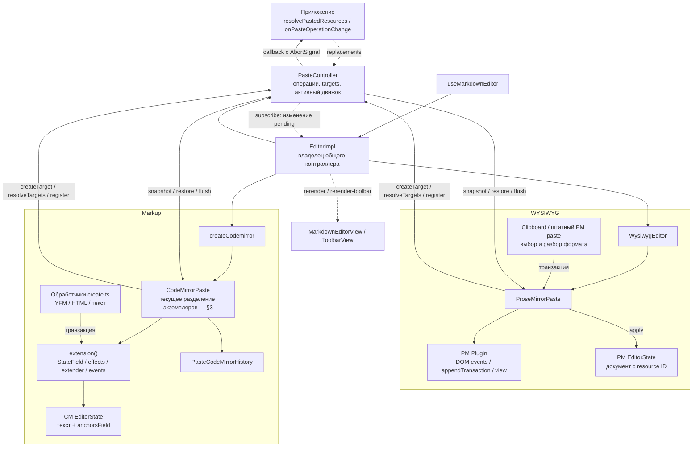

Основной порядок: **вставка документа → запрос приложения → изменение URL**.
Управление редактором остаётся доступным во время запроса.

## 2. Файлы и ответственность

| Файл                                                                                                                | Основные сущности                                               | Ответственность                                                                     |
| ------------------------------------------------------------------------------------------------------------------- | --------------------------------------------------------------- | ----------------------------------------------------------------------------------- |
| [bundle/useMarkdownEditor.ts](../packages/editor/src/bundle/useMarkdownEditor.ts)                                   | `useMarkdownEditor`                                             | Сборка параметров и жизненный цикл экземпляра редактора                             |
| [bundle/Editor.ts](../packages/editor/src/bundle/Editor.ts)                                                         | `EditorImpl`                                                    | Создание контроллера; передача его движкам; смена режима; публичные операции отмены |
| [bundle/types.ts](../packages/editor/src/bundle/types.ts)                                                           | `MarkdownEditorOptions`                                         | Подключение `paste` к API редактора и экспорт типов                                 |
| [bundle/editor-public-types.ts](../packages/editor/src/bundle/editor-public-types.ts)                               | `MarkdownEditorInstance`                                        | Включение `PasteOperationControl` в публичный интерфейс                             |
| [modules/paste/types.ts](../packages/editor/src/modules/paste/types.ts)                                             | `PasteIntegration`, `PastedResource`, `PasteResourceResolution` | Контракт приложения                                                                 |
| [modules/paste/tracking.ts](../packages/editor/src/modules/paste/tracking.ts)                                       | `ResourceTarget`, `ResourceOccurrence`, `PasteEngine`           | Общая идентичность и интерфейс движка                                               |
| [modules/paste/controller.ts](../packages/editor/src/modules/paste/controller.ts)                                   | `PasteController`, `validateResolution`                         | Асинхронные операции, проверка ответа, отмена, таймауты, сохранение результатов     |
| [core/Editor.ts](../packages/editor/src/core/Editor.ts)                                                             | `WysiwygEditor`                                                 | Создание PM-адаптера, подключение его плагина и `dispatch`                          |
| [Clipboard/index.ts](../packages/editor/src/extensions/behavior/Clipboard/index.ts)                                 | `Clipboard`                                                     | Регистрация существующих clipboard-плагинов через builder                           |
| [Clipboard/clipboard.ts](../packages/editor/src/extensions/behavior/Clipboard/clipboard.ts)                         | `clipboard`                                                     | Чтение форматов буфера и вставка содержимого                                        |
| [Clipboard/resources/adapter.ts](../packages/editor/src/extensions/behavior/Clipboard/resources/adapter.ts)         | `ProseMirrorPaste`                                              | Идентификация вставки, ID узлов, применение URL, связь с PM history                 |
| [Clipboard/resources/resources.ts](../packages/editor/src/extensions/behavior/Clipboard/resources/resources.ts)     | `ResourceCollection`, функции обхода и сравнения                | Работа с PM-моделью и проверка URL; используется также Markup-частью                |
| [ImageSpecs/index.ts](../packages/editor/src/extensions/markdown/Image/ImageSpecs/index.ts)                         | Схема изображения                                               | Атрибут `__pasteResourceId`, исключаемый из HTML                                    |
| [YfmFileSpecs/index.ts](../packages/editor/src/extensions/yfm/YfmFile/YfmFileSpecs/index.ts)                        | Схема файла                                                     | Атрибут ID, исключаемый из HTML и Markdown                                          |
| [markup/codemirror/create.ts](../packages/editor/src/markup/codemirror/create.ts)                                   | `createCodemirror`                                              | Создание CM-адаптера, расширений и обработчиков clipboard                           |
| [paste-resources/adapter.ts](../packages/editor/src/markup/codemirror/paste-resources/adapter.ts)                   | `CodeMirrorPaste`                                               | Диапазоны ресурсов, effects, транзакции и регистрация движка                        |
| [paste-resources/resources.ts](../packages/editor/src/markup/codemirror/paste-resources/resources.ts)               | `prepareMarkupResources`, `referenceImages`                     | Поиск и проверка исходных диапазонов Markdown                                       |
| [paste-resources/history.ts](../packages/editor/src/markup/codemirror/paste-resources/history.ts)                   | `PasteCodeMirrorHistory`                                        | Коррекция более раннего события истории CodeMirror                                  |
| [paste-resources/history-boundary.ts](../packages/editor/src/markup/codemirror/paste-resources/history-boundary.ts) | `pasteHistoryBoundary`                                          | Facet с callbacks для внешней группировки истории                                   |
| [html-to-markdown/converters.ts](../packages/editor/src/markup/codemirror/html-to-markdown/converters.ts)           | `MarkdownConverter`                                             | Преобразование HTML; callback `fileLink` для файловых вложений                      |
| [files-upload-plugin/plugin.ts](../packages/editor/src/markup/codemirror/files-upload-plugin/plugin.ts)             | `FilesUploadPlugin`, presenter, widget                          | Отдельная загрузка бинарных файлов                                                  |

## 3. Создание и подключение

### 3.1. Общий владелец

`EditorImpl` создаёт `PasteController` всегда, даже без callback разрешения ресурсов.
`controller.enabled` равен наличию `resolvePastedResources`. Параметры callback
задаются при создании; метода их динамической замены нет.

Движки создаются лениво, при обращении к `wysiwygEditor` и `markupEditor`.
Каждый получает ссылку на один и тот же контроллер.

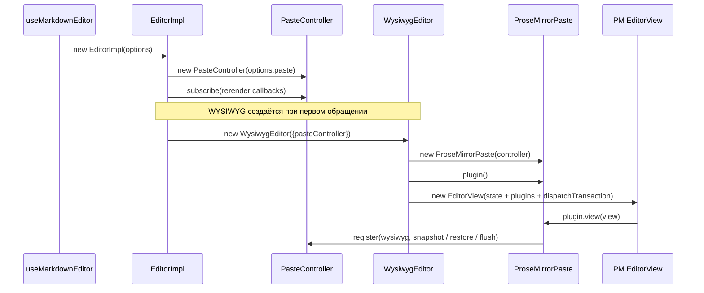

В PM создание адаптера пока проверяет наличие контроллера, а не `enabled`.
Существующий `Clipboard` регистрируется через `ExtensionBuilder`; ресурсный
адаптер подключается напрямую в `core/Editor.ts`.

### 3.2. Фактическое подключение CodeMirror в рабочей копии

На момент составления документа `create.ts` создаёт **два** объекта
`CodeMirrorPaste`. Это важно для чтения последующих схем.

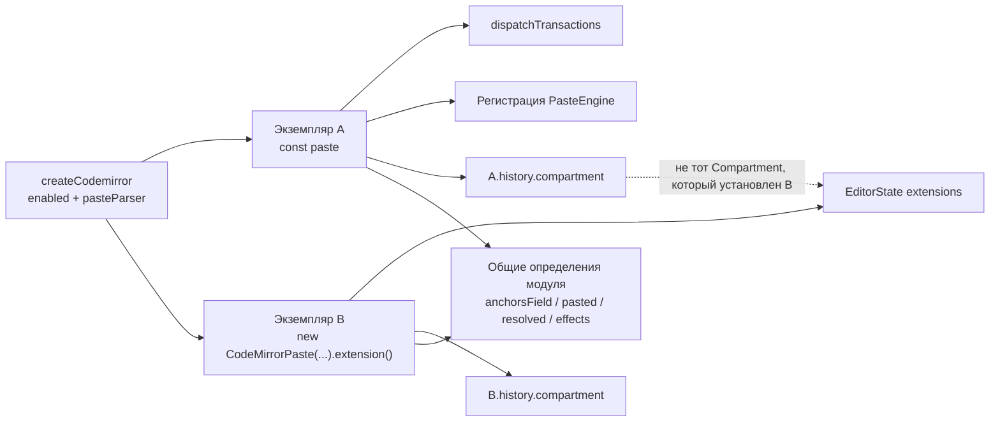

`extension()` замыкает `event`, `shift` и `history` экземпляра B, а `dispatch`,
`attach`, `restore`, `flush` используют экземпляр A. Определения `StateField`,
annotations и effects находятся на уровне модуля и поэтому общие.

Однако `history.compartment` создаётся на экземпляр: в состоянии установлен
Compartment B, а коррекция истории из A обращается к Compartment A. Это разрыв
связи в текущем подключении. Следующие разделы описывают алгоритмы методов;
они не являются подтверждением корректной работы двух экземпляров вместе.

Связное подключение одного экземпляра выглядело бы так:

```ts
const paste =
  params.pasteController?.enabled && params.pasteParser
    ? new CodeMirrorPaste(params.pasteController, params.pasteParser)
    : undefined;

if (paste) extensions.push(paste.extension());
// Этот же paste используется в dispatchTransactions и attach(view).
```

Это пояснение схемы, а не изменение реализации в рамках документа.

## 4. Данные и идентичность

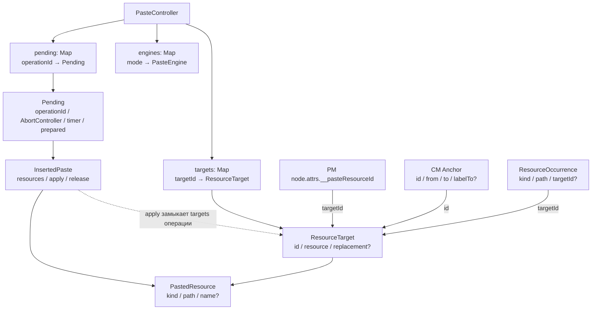

Три разных понятия:

- **Операция** — один асинхронный вызов приложения, ID вида `paste-N`.
- **Ресурс** — пара `kind + path`; `resourceKey` кодирует её через `JSON.stringify`.
- **Target** — отслеживаемый экземпляр ресурса с UUID. В PM это конкретный узел;
  в CM обычно исходный диапазон URL или ссылочного изображения.

Одинаковые ресурсы дедуплицируются внутри запроса, но несколько targets могут
ссылаться на одну пару `kind + path`. Разные вставки имеют отдельные targets.
Сопоставление ответа ограничено ресурсами конкретной операции.

`pending` очищается при завершении операции. `targets` и полученные замены
сохраняются до уничтожения контроллера: они нужны, если Undo убрал вставку,
а Redo позже вернул её. Это состояние в памяти, не сохраняемое в Markdown.

## 5. Жизненный цикл запроса

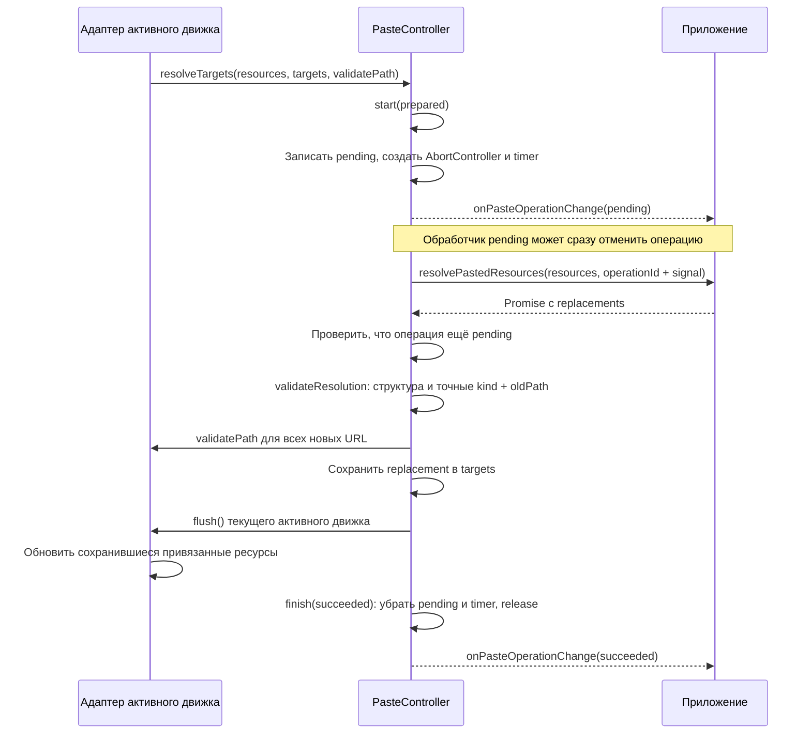

| Метод контроллера                          | Смысл                                                                         |
| ------------------------------------------ | ----------------------------------------------------------------------------- |
| `register(mode, engine)`                   | Сохранить callbacks адаптера; вернуть функцию удаления регистрации            |
| `activate(mode, snapshot?)`                | Назначить активный режим, при наличии восстановить snapshot, вызвать `flush`  |
| `snapshot()`                               | Запросить состояние привязок у активного движка, если обработка включена      |
| `createTarget(resource)` / `getTarget(id)` | Создать или получить идентичность ресурса                                     |
| `resolveTargets(...)`                      | Подготовить операцию: проверка URL, сохранение результатов, применение        |
| `start(prepared)`                          | Зарегистрировать pending, таймаут и запустить callback                        |
| `resolve(operation)`                       | Дождаться ответа, проверить актуальность и применить результат                |
| `finish(...)`                              | Единожды завершить операцию, освободить её состояние и уведомить наблюдателей |
| `cancelPaste(id)`                          | Завершить указанную операцию как cancelled                                    |
| `fail(id, error)`                          | Завершить указанную pending-операцию как failed                               |
| `getPendingPasteOperations()`              | Вернуть список выполняющихся операций                                         |
| `subscribe(listener)`                      | Подписать внутреннюю оболочку редактора на изменение pending                  |
| `destroy()`                                | Отменить все pending и очистить targets, регистрации и подписки               |

`validateResolution` отклоняет неизвестные пары `kind + oldPath`, пустые новые
пути, неверную структуру и противоречивые дубликаты. Одинаковые дубликаты допустимы.
Пропущенные ресурсы и пустой список замен сохраняют исходные URL.

Перед сохранением результатов проверяются все возвращённые URL. Если `flush`
бросает ошибку, кеш замены у targets этой операции очищается. Общий контроллер
не реализует откат уже применённых транзакций документа.

`succeeded` означает, что ответ обработан. Это не гарантирует, что изменено
столько же вхождений, сколько было вставлено: пользователь мог удалить их,
изменить URL или выполнить Undo.

## 6. WYSIWYG: путь вставки

### 6.1. Плагин и обёртка dispatch

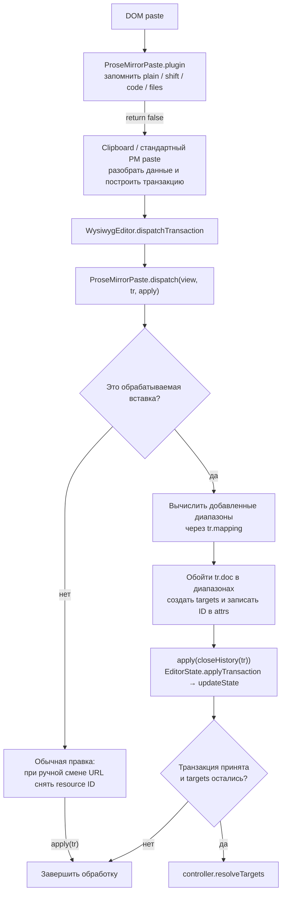

Условие вставки включает `enabled`, `docChanged`, контекст DOM paste или
`uiEvent = paste`. Исключаются собственная замена (`resolvedPasteMeta`), remote
транзакция и `plain`-контекст. Plain здесь включает Shift, позицию внутри кода
или специальный случай бинарных файлов. Контекст DOM-события сбрасывается в microtask.

Существующий `Clipboard` обрабатывает YFM и текст своими parsers, отдельный
случай iOS URI list, извлекаемый Markdown из HTML и загрузку файлов. Обычный HTML
может передаваться штатной PM-вставке. Ресурсный адаптер не заменяет эту логику.

### 6.2. Дополнение транзакции

1. Для подходящих локальных изменений создаётся копия транзакции с отдельными
   `steps`, `docs`, `mapping`, `meta`. Это защита от предварительного вычисления
   исходного объекта обёртками dispatch, например DevTools.
2. Новые диапазоны каждого шага переводятся через оставшиеся mapping в
   координаты итогового `tr.doc`.
3. Обход пропускает code-узлы и узлы с code-mark.
4. `resourceAttribute` распознаёт `image.src` и `FILE_TOKEN.href`.
5. `ResourceCollection.add` собирает уникальные ресурсы; каждому вхождению
   назначается target и атрибут `__pasteResourceId`.
6. Транзакция применяется с границами истории до и после вставки.
7. Проверяется, вошла ли она в принятые `applyTransaction` транзакции и какие ID
   присутствуют в итоговом документе. Только оставшиеся targets идут в запрос.

Фильтры ProseMirror могут отклонить вставку, а `appendTransaction` других плагинов
может нормализовать документ. Поэтому запуск запроса находится после `apply`.

## 7. WYSIWYG: применение результата и история

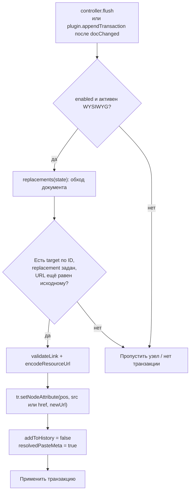

`flush` также проверяет уничтожение view, редактируемость и отсутствие той же
неприменённой замены после dispatch. Атрибут меняется отдельным шагом, поэтому
остальные атрибуты, содержимое узла и выделение не заменяются целиком.

Для обычной локальной правки `dispatch` сравнивает URL по resource ID в
`tr.before` и `tr.doc`. Изменившемуся URL сбрасывается ID **в той же транзакции**.
Undo такой правки может восстановить и исходный URL, и привязку.
Эта процедура исключает remote, собственные замены и транзакции истории.

При Undo вставки узел исчезает, но target с результатом остаётся в контроллере.
После Redo узел с ID возвращается; `appendTransaction` снова применяет кешированный
URL. Повторного запроса приложения не требуется.

## 8. Markup: расширение CodeMirror

`CodeMirrorPaste` состоит из декларативной настройки состояния и методов,
которые вызываются из `createCodemirror`.

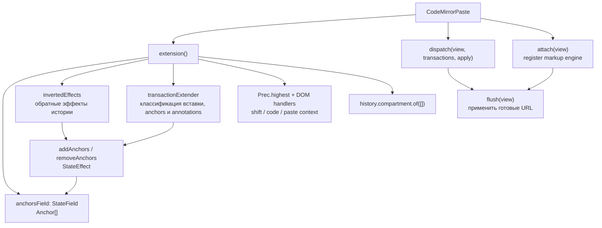

| Элемент               | Данные и поведение                                                                                                     |
| --------------------- | ---------------------------------------------------------------------------------------------------------------------- |
| `Anchor`              | `id`, `from`, `to`, необязательный `labelTo` для ссылочного изображения                                                |
| `mapAnchor`           | Пересчитывает позиции через изменения; при затрагивании URL снимает привязку; допускает правку подписи reference image |
| `anchorsField`        | На каждой транзакции обновляет позиции и применяет add/remove effects                                                  |
| `addAnchors`          | Добавляет привязки; имеет собственное правило mapping эффекта                                                          |
| `removeAnchors`       | Удаляет привязки по ID                                                                                                 |
| `pasted`              | Annotation с targets вставки; соединяет transaction extender и dispatch                                                |
| `resolved`            | Annotation собственной автоматической замены                                                                           |
| `invertedEffects`     | Описывает обратные изменения набора привязок для Undo/Redo                                                             |
| `transactionExtender` | Обнаруживает вставку, создаёт targets, добавляет effects и `isolateHistory`                                            |
| `attach`              | Регистрирует snapshot/restore/flush; возвращает функцию удаления регистрации                                           |
| `dispatch`            | Вызывает границы внешней истории, применяет транзакции, запускает запрос и повторное применение кеша                   |

`applying` защищает `flush` от повторного входа во время собственного dispatch.
`destroyed` предотвращает применение после удаления регистрации.

## 9. Markup: распознавание и применение

### 9.1. От события до запроса

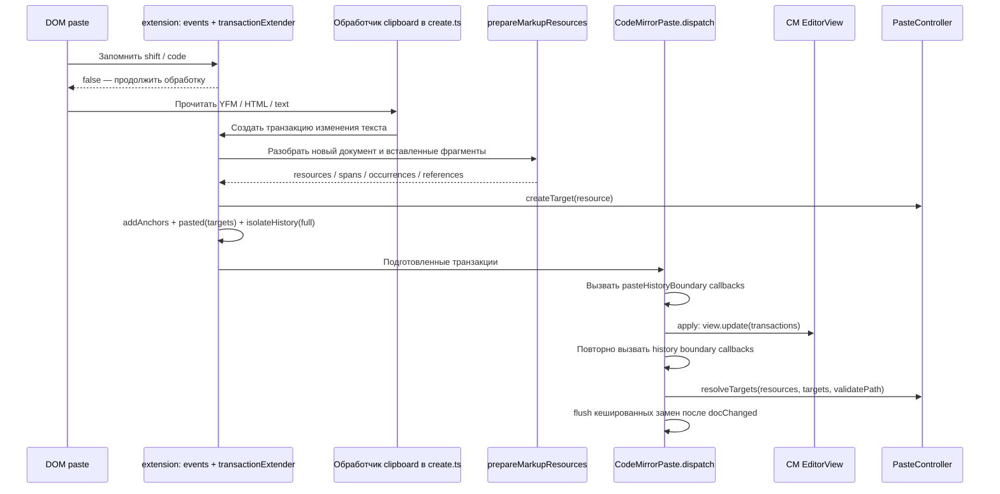

Extender исключает remote-транзакции, `resolved`, plain-контекст и операции,
которые не являются вставкой. Отдельно проверяет изменения определений
ссылочных изображений и снимает устаревшие привязки.

### 9.2. Как находится исходный диапазон URL

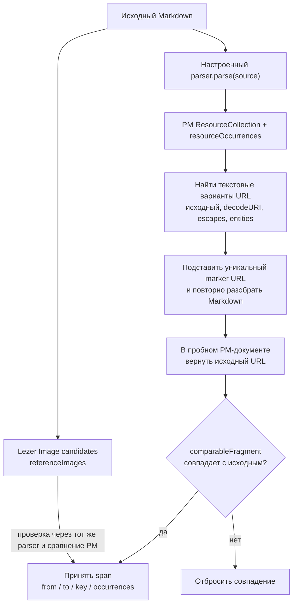

Сравнение исключает случайно генерируемые DOM ID вкладок и чекбоксов. Оно не
исключает содержание, URL или остальные значимые атрибуты.

Обычный текст, код и адрес обычной ссылки не должны проходить эту проверку как
ресурс изображения/файла. Неподдерживаемый диапазон может быть сообщён приложению,
но без надёжной привязки результат не перепишет произвольное совпадение URL.

`prepareMarkupResources` также возвращает вспомогательный `replace(...)` с
проверкой итоговой структуры. Основной `CodeMirrorPaste.flush` использует найденные
spans; для reference image вызывает `reference.replace(...)`.

### 9.3. Применение ответа

`flush` выбирает anchors, для которых есть новый URL, затем заново проверяет их
против актуального текста и parser. Обычный URL заменяется в своём диапазоне.

Reference image переводится в inline image, например:

```md
![report][attachment]

[attachment]: /old.png
```

становится для выбранного вхождения:

```md


[attachment]: /old.png
```

Общее определение сохраняется. Другие использования `attachment` не получают
замену автоматически. Подпись сохраняется отдельным диапазоном; title также
сохраняется и экранируется.

Перед dispatch проверяются readOnly/editable. Изменения сортируются, новые
anchors вычисляются в координатах нового документа. Транзакция получает
`resolved = true` и `addToHistory = false`, а история корректируется через
`PasteCodeMirrorHistory.amend`. После dispatch проверяется ожидаемый документ.

## 10. HTML и файловые ссылки

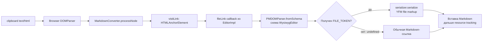

`fileLink` передаётся конвертеру только при `pasteController.enabled`.
Callback распознаёт тип по правилам PM-схемы; обычная ссылка не становится файлом
только из-за расширения `.pdf` или похожего URL.

Без сохранения файловой семантики HTML-вложение стало бы обычной ссылкой и не
попало бы в обработку ресурсов. Приоритет `text/yfm` позволяет использовать
готовую разметку без HTML-конвертации, если она есть в буфере.

## 11. История CodeMirror

Вставка сразу меняет документ, а URL приходит позже, возможно после нескольких
других правок. `addToHistory = false` сам по себе не описывает, как связать позднюю
замену с более ранним событием вставки. Для этого есть `PasteCodeMirrorHistory`.

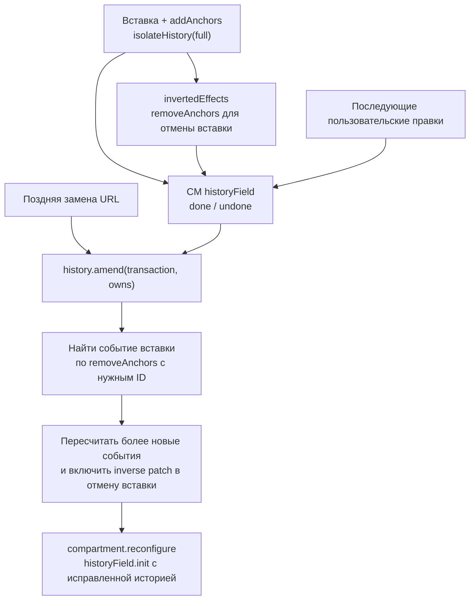

- `tagLast` добавляет effect в последнее событие с изменением документа. Это
  используется при восстановлении привязок после смены режима.
- `amend` идёт по истории от новых событий к старым, находит событие нужной
  вставки и пересчитывает изменения и выделения.
- Старые объекты истории не изменяются на месте: создаются копии с исходными
  прототипами.
- Реализация использует внутреннюю форму `HistoryState/HistoryEvent` из
  `@codemirror/commands`. Проверка поддерживаемой формы есть в `amend`.
- Без `historyField` методы коррекции возвращают пустой набор effects.
- `pasteHistoryBoundary` — отдельный facet для внешних механизмов истории.
  Он вызывает переданные функции до и после вставки; сам по себе не реализует
  совместное редактирование или внешнюю историю.

Для этой схемы принципиально, чтобы установленный Compartment принадлежал
экземпляру, вызывающему `amend/tagLast`; см. расхождение в §3.2.

## 12. Переключение режимов

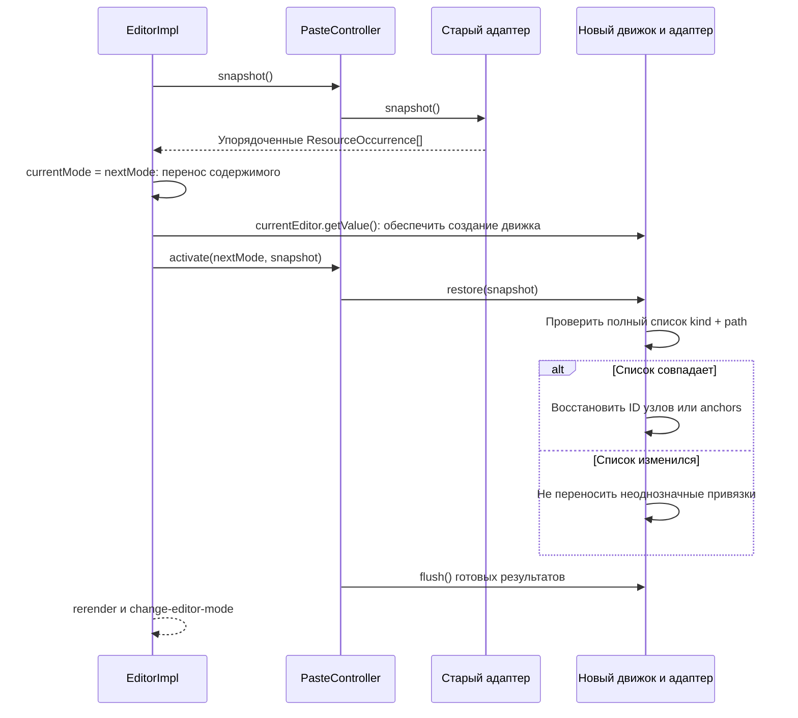

Snapshot включает и ресурсы без target ID, чтобы проверить полное соответствие
порядка. PM восстанавливает ID через транзакцию без истории; CM пересоздаёт anchors
и связывает их эффекты с историей.

Контроллер не отменяет запросы при смене режима. Когда ответ приходит, он
вызывает `flush` у **текущего** активного движка. Это перенос идентичности ресурсов,
а не перенос всей истории редактирования между ProseMirror и CodeMirror.

## 13. Отмена, ошибки и уничтожение

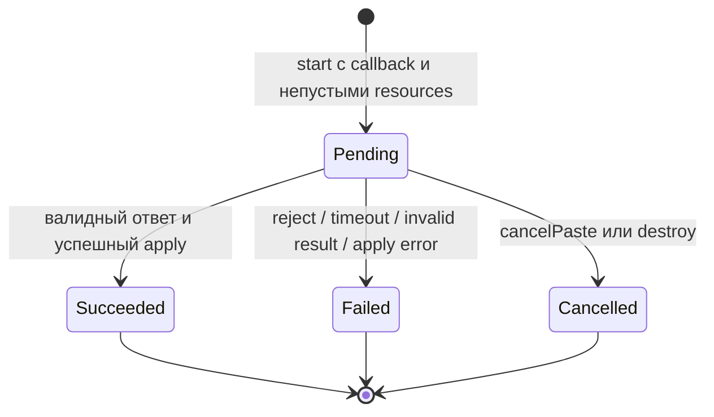

Если callback отсутствует, ресурсов нет или контроллер уничтожен, `start`
возвращает `false` без создания pending-операции.

Порядок `finish`:

1. Проверить, что это всё ещё та же pending-операция.
2. Очистить таймер и удалить запись из `pending`.
3. Вызвать `prepared.release()`; для `resolveTargets` сейчас это пустая функция.
4. Для failed/cancelled вызвать `AbortController.abort()`.
5. Уведомить внутренние подписки и затем `onPasteOperationChange`.

Повторное завершение и поздний ответ игнорируются. Ошибки наблюдателей передаются
в `reportError`. Отмена не удаляет уже вставленное содержимое и не обещает
отката действий сервера. Таймаут по умолчанию — 120 секунд.

### Фактические точки уничтожения

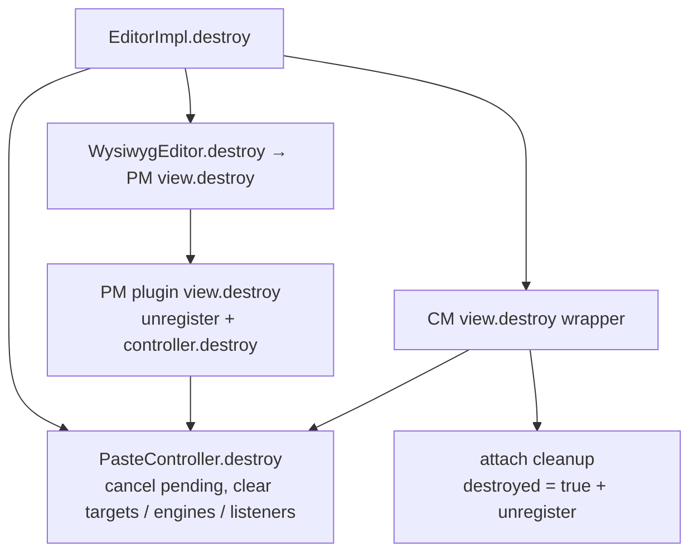

Хотя владельцем контроллера является `EditorImpl`, текущие destroy-hooks движков
тоже вызывают `controller.destroy()`. Поэтому отдельное уничтожение одного
движка не изолировано: оно завершает общие операции. Обычное переключение режима
сохраняет экземпляры движков и не использует этот путь уничтожения.

## 14. Бинарные файлы и FilesUploadPlugin

Это соседняя функциональность с другим входом и жизненным циклом.

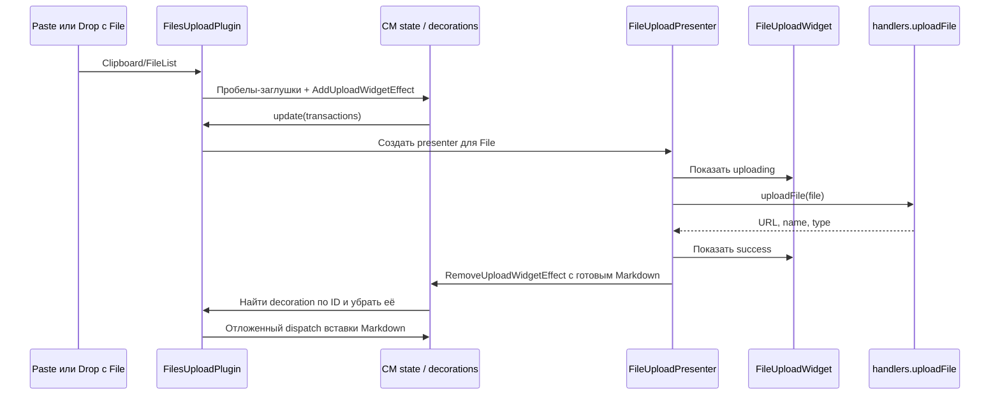

| Свойство                | FilesUploadPlugin                                    | Paste resources                                          |
| ----------------------- | ---------------------------------------------------- | -------------------------------------------------------- |
| Вход                    | Бинарные `File`                                      | URL ресурсов в документе                                 |
| Пока выполняется запрос | Виджет и пробел-заглушка                             | Уже вставленный редактируемый контент                    |
| Позиция                 | DecorationSet с mapping                              | PM ID или CM StateField с anchors                        |
| Настройки               | `FileUploadHandlerFacet`                             | Контроллер и parser, переданные при создании             |
| Отмена                  | Presenter выставляет canceled и игнорирует результат | AbortSignal, статус, таймаут и защита от позднего ответа |
| История                 | Обычные транзакции плагина                           | Дополнительное отслеживание и коррекция истории          |
| Смена режима            | В этом плагине нет переноса операции между движками  | Общий controller + snapshot/restore                      |

`FileUploadWidget` использует `ReactRendererFacet` для отрисовки статуса.
При уничтожении widget вызывается `presenter.cancel()`. Это логическая отмена;
контракт `uploadFile(file)` не передаёт AbortSignal.

В WYSIWYG существуют `Clipboard.pasteFileHandler` и поведение `FilePaste`.
Последнее вставляет имена файлов как fallback для paste/drop. Эти механизмы
не являются `ProseMirrorPaste` и не должны смешиваться с разрешением URL.

## 15. Границы и особенности текущего подключения

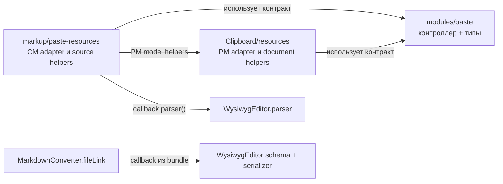

1. **Контроллер не зависит от движков.** Его зависимости — локальные типы,
   tracking и генерация UUID.
2. **Адаптеры не полностью независимы по импорту.** CM использует PM-функции
   проверки структуры. PM resource helpers не импортируют CodeMirror.
3. **Parser привязан к визуальному редактору.** Callback
   `() => this.wysiwygEditor.parser` может лениво создать весь WYSIWYG-движок.
   Аналогично `pasteFileLink` использует его schema и serializer.
4. **PM-ядро знает о paste.** `core/Editor.ts` создаёт адаптер и оборачивает
   dispatch; это не только обычное `builder.addPlugin` внутри `Clipboard`.
5. **Схемы изображения и файла знают о tracking.** В них объявлен атрибут ID,
   который исключается из выходной разметки.
6. **Включение асимметрично.** CM проверяет `enabled`, PM пока проверяет только
   наличие контроллера. HTML file conversion также зависит от `enabled`.
7. **В текущем CM-подключении два экземпляра.** Это зафиксировано в §3.2;
   диаграммы алгоритмов не скрывают эту проблему сборки.
8. **Destroy движка завершает общий controller.** Это ограничивает независимый
   жизненный цикл движков; см. §13.
9. **Метаданные не заменяют интеграцию с collaboration.** PM учитывает
   `remotePasteTransactionMeta`/`rebased`, CM — `Transaction.remote` при
   классификации вставки. Внешний код должен корректно маркировать свои операции.
10. **ID и результаты не сериализуются как постоянное состояние.** Они живут с
    экземпляром редактора; для произвольной внешней замены всего документа нет
    универсального восстановления привязок.

Это наблюдения по текущему коду, а не список уже выполненных исправлений.

## 16. Сценарии и тесты

| Сценарий                                                    | Механизм                                                               |
| ----------------------------------------------------------- | ---------------------------------------------------------------------- |
| Две вставки одного URL завершились в обратном порядке       | Отдельные операции и targets; ответ ограничен ресурсами своей операции |
| Пользователь ввёл текст перед ресурсом                      | PM ID остаётся на узле; CM пересчитывает диапазон                      |
| Пользователь поменял URL                                    | PM снимает ID; CM снимает или перепроверяет anchor                     |
| Пользователь поменял подпись                                | URL остаётся связанным; reference image допускает изменения label      |
| Ресурс удалён или вставка отменена                          | Нет живого узла/anchor; callback не вставляет его заново               |
| Ответ пришёл после Undo                                     | Результат кешируется в target для последующего Redo                    |
| В документе уже был такой URL                               | Старое вхождение не получает target текущей вставки                    |
| Смена режима во время запроса                               | Сопоставление полного списка ресурсов и перенос ID                     |
| При смене режима изменился список ресурсов                  | Неоднозначные привязки не восстанавливаются                            |
| Callback вернул неверный URL                                | Проверка ответа и parser validation до сохранения всех замен           |
| Callback вернул только часть ресурсов                       | Остальные URL сохраняются                                              |
| Пользователь отменил одну из операций                       | Отменяется только её signal; остальные операции продолжаются           |
| Поздний ответ после отмены                                  | Проверка актуальности pending отклоняет результат                      |
| Reference definition используется несколькими изображениями | Замена выбранного вхождения в inline-форме; definition сохраняется     |
| Редактор стал readOnly перед ответом                        | Адаптер отклоняет требуемое изменение документа                        |

Источники сценариев:

- [controller.test.ts](../packages/editor/src/modules/paste/controller.test.ts) —
  жизненный цикл, отмена, таймауты, валидация и параллельные операции.
- [integration.test.ts](../packages/editor/tests/paste/integration.test.ts) —
  оба движка, форматы clipboard, история, remote mappings, reference images,
  ручные изменения и отказ применения.
- [PasteResources.visual.test.tsx](../demo/tests/visual-tests/PasteResources.visual.test.tsx) —
  браузерные сценарии с React-оболочкой.
- [PasteResources.helpers.tsx](../demo/tests/visual-tests/PasteResources.helpers.tsx) —
  управляемый callback, кнопки разрешения/отмены и наблюдение событий.

Наличие сценария в тестах не означает, что текущая изменяемая рабочая копия
проверена им. При создании этой документации runtime-тесты редактора не запускались;
отдельно проверяются ссылки и синтаксис Mermaid-диаграмм.
