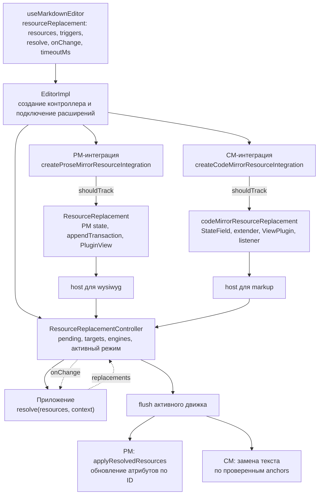
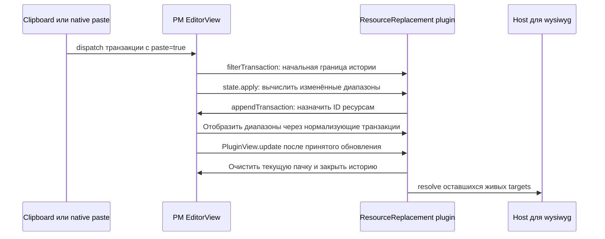
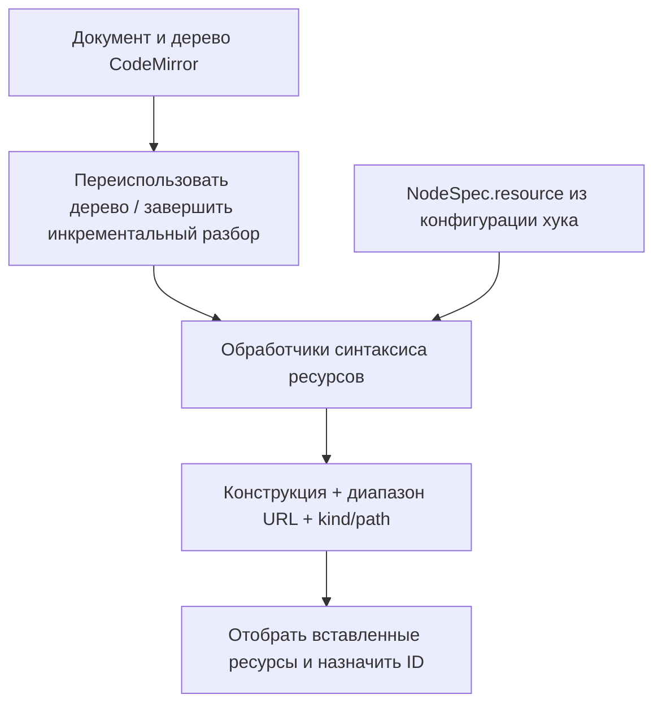
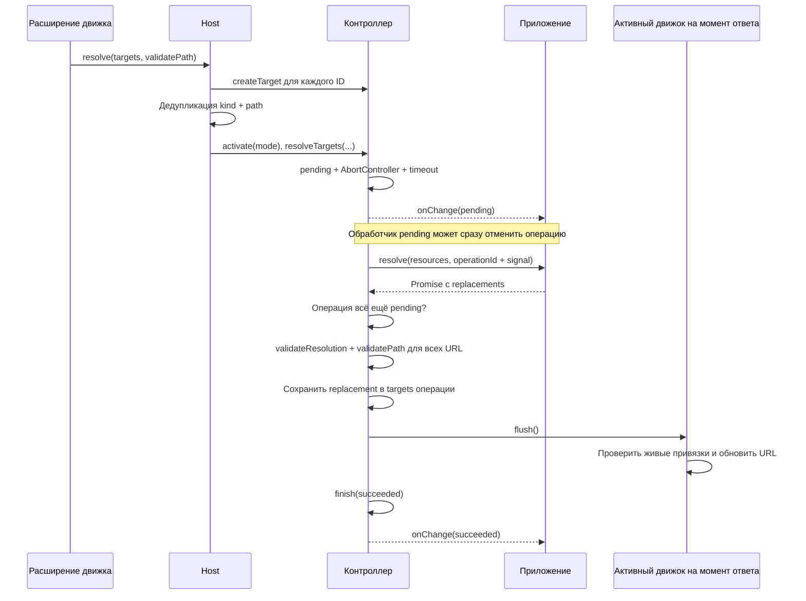
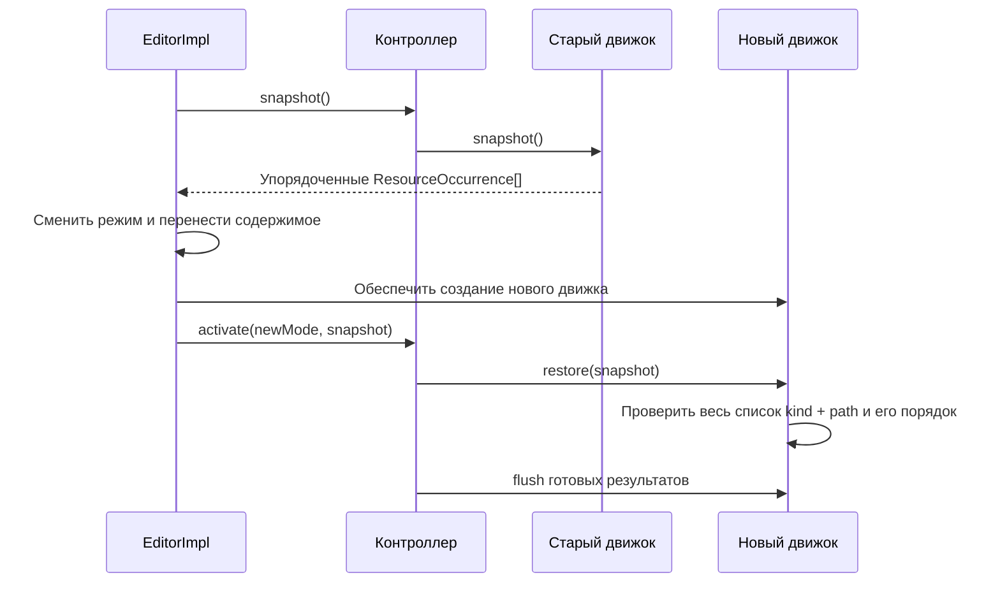
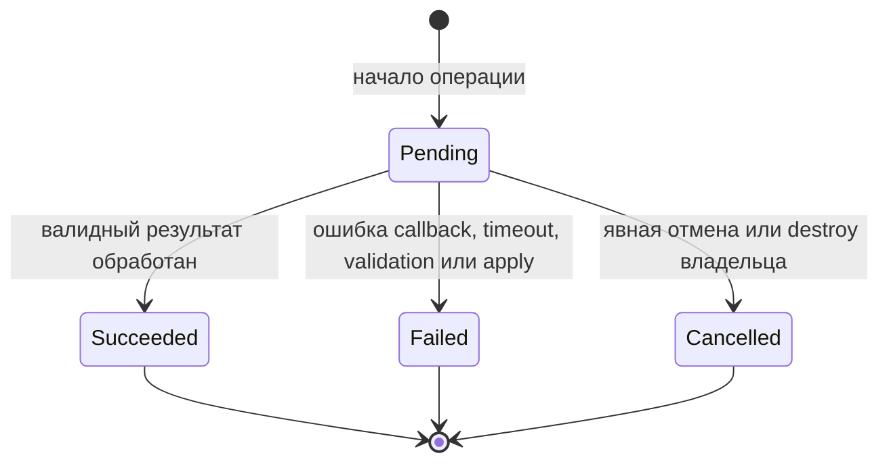

# Архитектура замены ресурсов

Документ описывает текущую реализацию в рабочем дереве на 17 сентября 2026 года:
публичный API, распределение ответственности, путь транзакции и асинхронного
результата, историю, смену режима и время жизни состояния. Возможные дальнейшие
изменения отмечены отдельно и не являются уже реализованными возможностями.

Замена ресурсов — обработка URL уже вставленных изображений, файлов и других
настроенных узлов. Основной порядок: **вставить содержимое → найти и привязать
ресурсы → вызвать приложение → применить новые URL**. Пока приложение обрабатывает
запрос, документ остаётся доступным для редактирования.

Практический пример подключения находится в
[руководстве по настройке](how-to-resolve-pasted-resources.md).
Все сокращённые пути `src/` ниже относятся к `packages/editor/src/`.

## Навигация

1. [Общая схема и слои](#1-общая-схема-и-слои)
2. [Публичный API и ответственность приложения](#2-публичный-api-и-ответственность-приложения)
3. [Сборка и политика выбора транзакций](#3-сборка-и-политика-выбора-транзакций)
4. [Ресурс, операция, target и привязка](#4-ресурс-операция-target-и-привязка)
5. [Host и общий контроллер](#5-host-и-общий-контроллер)
6. [WYSIWYG: отслеживание и применение](#6-wysiwyg-отслеживание-и-применение)
7. [Markdown: отслеживание и применение](#7-markdown-отслеживание-и-применение)
8. [Полный жизненный цикл запроса](#8-полный-жизненный-цикл-запроса)
9. [Undo и Redo](#9-undo-и-redo)
10. [Переключение режима](#10-переключение-режима)
11. [Завершение, отмена и очистка](#11-завершение-отмена-и-очистка)
12. [Кастомные ресурсы и новые источники изменений](#12-кастомные-ресурсы-и-новые-источники-изменений)
13. [Clipboard, HTML и загрузка файлов](#13-clipboard-html-и-загрузка-файлов)
14. [Границы, ограничения и дальнейшее развитие](#14-границы-ограничения-и-дальнейшее-развитие)
15. [Карта файлов](#15-карта-файлов)
16. [Сценарии проверки](#16-сценарии-проверки)

## 1. Общая схема и слои

Архитектура разделяет выбор изменений, идентичность ресурсов, асинхронную работу
и редактирование документа. Это позволяет использовать один запрос приложения
при смене движка и не связывать контроллер с моделями PM или CM.

| Слой                 | Основные компоненты                                        | Ответственность                                                                              |
| -------------------- | ---------------------------------------------------------- | -------------------------------------------------------------------------------------------- |
| 1. Публичный API     | `useMarkdownEditor`, `ResourceReplacementConfig`           | Конфигурация ресурсов и callback приложения                                                  |
| 2. Сборка и политика | `EditorImpl`, PM/CM-интеграции                             | Создание контроллера, подключение расширений, выбор транзакций через `shouldTrack`           |
| 3. Отслеживание      | `ResourceReplacement`, `codeMirrorResourceReplacement`     | Поиск ресурсов в выбранных изменениях и поддержание привязок к документу                     |
| 4. Общий сервис      | `ResourceReplacementHost`, `ResourceReplacementController` | Регистрация targets, дедупликация запроса, операции, отмена, проверка и хранение результатов |
| 5. Применение        | PM-команда и CM `flush`                                    | Обновление URL в активном движке с учётом текущего документа и истории                       |

Слои отслеживания и применения реализованы в расширениях соответствующего движка.
Это разные обязанности, а не обязательно отдельные пакеты.



Стрелки показывают вызовы и передачу данных, а не только импорты. Приложение
получает изменения статуса операций через `resourceReplacement.onChange`.

Ключевые границы:

- Интеграция определяет, **когда** нужно начать обработку.
- Расширение определяет, **какие экземпляры** ресурсов относятся к изменению.
- Host связывает расширение с сервисами конкретного режима.
- Контроллер управляет **асинхронной операцией и её результатом**.
- Приложение получает новые URL, например копирует ресурсы на сервере.
- Активный движок решает, **где и как** применить результат в текущем документе.

## 2. Публичный API и ответственность приложения

### 2.1. Конфигурация

В текущем API настройка называется `resourceReplacement`, callback — `resolve`.
Названия `paste` и `resolvePastedResources` относятся к прежней схеме.

```ts
type ResourceDescription = {
  kind: string;
  urlAttribute: string;
  nameAttribute?: string;
};

type ResourceTrigger = 'paste' | 'drop' | {
  name: 'paste' | 'drop';
  allowSameOrigin?: boolean; // false по умолчанию
};

type ResourceReplacementConfig = {
  resources?: Readonly<Record<string, ResourceDescription | false>>;
  triggers?: readonly ResourceTrigger[];
  resolve?: (
    resources: readonly ReplacementResource[],
    context: {operationId: string; signal: AbortSignal},
  ) => Promise<ResourceReplacementResult>;
  onChange?: (event: ResourceReplacementEvent) => void;
  timeoutMs?: number;
};
```

| Поле        | Смысл                                                             | Поведение по умолчанию                                      |
| ----------- | ----------------------------------------------------------------- | ----------------------------------------------------------- |
| `resources` | Описания ресурсов по именам узлов | Нет; без настройки ресурсы не отслеживаются |
| `triggers`  | Какие источники изменений включает стандартная интеграция         | `[]`; расширения замены не подключаются                     |
| `resolve`   | Асинхронное получение новых URL                                   | Без callback контроллер и расширения замены не подключаются |
| `onChange`  | Уведомление о состоянии конкретной операции                       | Необязателен                                                |
| `timeoutMs` | Максимальное ожидание результата операции                         | `120_000` мс                                                |

`timeoutMs` должен быть конечным положительным числом. Это не TTL для targets,
не срок жизни anchors и не срок хранения результата для Redo.

Стандартные интеграции обрабатывают `paste` и `drop` независимо.
Настройка `['paste', 'drop']` включает оба источника; `['drop']` — только drop.

Узлы без `NodeSpec.resource` не отслеживаются; отсутствующий или пустой
`triggers: []` отключает подключение интеграций обоих движков.
Это отличается от отсутствующего `resolve`:
при наличии callback контроллер всё равно создаётся.

### 2.2. Описание ресурса

Ресурсы явно задаются в `useMarkdownEditor`:

```ts
resourceReplacement: {
  resources: {
    image: {kind: 'image', urlAttribute: 'src', nameAttribute: 'alt'},
    video: {kind: 'video', urlAttribute: 'src'},
  },
  triggers: ['paste', 'drop'],
  resolve: copyResources,
}
```

- Ключ — имя зарегистрированного узла.
- `kind` — тип ресурса для callback и сопоставления ответа.
- `urlAttribute` — атрибут узла со строковым URL.
- `nameAttribute` — необязательный атрибут с именем или подписью.

Дефолтов нет, в том числе в ImageSpecs и YfmFileSpecs. Отсутствующий `resources`
или `{}` отключает отслеживание ресурсов. Неуказанные узлы и значения `false`
не участвуют в замене, даже если пользовательское расширение задало свои метаданные.
При создании схемы конфигурация хука записывается в `NodeSpec.resource` после
пользовательских расширений и до подключения плагина замены.
В PM метаданные читаются из узлов документа; в CM обработчик синтаксиса
связывает узлы дерева Lezer с именем типа в общей схеме и её `NodeSpec.resource`.
Временные PM-узлы для отслеживания CM больше не создаются.

### 2.3. Вход и результат resolve

```ts
type ReplacementResource = {
  kind: string;
  path: string;
  name?: string;
};

type ResourceReplacementResult = {
  replacements: Array<{
    kind: string;
    oldPath: string;
    newPath: string;
  }>;
};
```

Callback получает описания ресурсов, а не `File`, DOM-узлы, PM-позиции или
CM-диапазоны. Входные объекты передаются как замороженные копии.
Результат — объект с `replacements`, а не массив на верхнем уровне.

Пара `kind + oldPath` должна точно соответствовать входной паре `kind + path`.
Если замена не возвращена, исходный URL сохраняется. `{replacements: []}` —
допустимый успешный ответ.

Относительные пути передаются так, как их представил парсер. Редактор не угадывает
исходную страницу. Авторизация, определение источника, копирование на сервере
и удаление ненужных серверных копий относятся к приложению.

### 2.4. operationId, signal и события

`operationId` идентифицирует один вызов `resolve`, обычно соответствующий одной
вставке. Это не ID ресурса и не постоянный идентификатор в сохранённом документе.
Текущая реализация генерирует строки вида `resource-replacement-N`; приложениям
следует использовать значение как непрозрачный идентификатор.

Он связывает callback, события `onChange`, список pending и явную отмену:

```ts
editor.getPendingResourceReplacements();
editor.cancelResourceReplacement(operationId);
```

`signal` — `AbortSignal`. Контроллер вызывает abort при явной отмене, таймауте,
ошибке операции и уничтожении владельца редактора. Callback должен передать его
в `fetch` или обработать самостоятельно. Игнорирование сигнала не позволяет
применить поздний ответ, но не останавливает выполняемую приложением работу.
Abort клиентского запроса также не гарантирует отмену серверного копирования.

```ts
type ResourceReplacementEvent = {
  operationId: string;
  status: 'pending' | 'succeeded' | 'failed' | 'cancelled';
  error?: unknown;
};
```

Каждая начатая операция получает `pending` и ровно один конечный статус.
`succeeded` означает, что результат обработан; число изменённых вхождений может
быть меньше числа исходных ресурсов или равно нулю.

## 3. Сборка и политика выбора транзакций

### 3.1. EditorImpl как владелец

`useMarkdownEditor` передаёт конфигурацию в `EditorImpl`. При наличии `resolve`
тот создаёт один `ResourceReplacementController` на экземпляр редактора.
Оба движка работают с этим контроллером, но получают отдельные hosts.

`id` передаёт приложение в `useMarkdownEditor`; библиотека не
генерирует его. Обработчики copy/cut и dragstart обоих режимов дописывают ID
в отдельный формат clipboardData/dataTransfer после штатной сериализации.
При drop интеграция читает источник из dataTransfer и применяет allowSameOrigin.
Обработчики записи источника подключаются независимо от
наличия resolver и триггеров. При вставке интеграция сравнивает ID источника
с ID получателя и передаёт `source?: {sameEditor: boolean}` через host и контроллер
в контекст `resolve`. Без любого из ID или при некорректных метаданных источник
неизвестен. По умолчанию совпадение ID исключает операцию из замены ресурсов:
не создаются цели, не вызываются `resolve` и `onChange`. Сама вставка выполняется.
Строковый триггер эквивалентен объекту `{name: 'paste', allowSameOrigin: false}`
для вставки. Объект `{name: 'paste', allowSameOrigin: true}` разрешает замену
при совпадении ID; тогда приложение всё ещё может вернуть `{replacements: []}`.
Неизвестный источник не блокирует замену. Здесь origin означает ID редактора,
а не origin URL.

Источник хранится в PM plugin state выбранной транзакции или CM annotation,
поэтому он не теряется при завершении DOM-события и не смешивается между операциями.

Движки создаются лениво. При создании WYSIWYG редактора bundle подключает
результат `createProseMirrorResourceIntegration(...)` через `builder.use`.
Эта интеграция собирает policy-плагин и расширение замены. При создании CM
редактора bundle передаёт результат `createCodeMirrorResourceIntegration(...)`
в обычный список extensions.

Без `resolve` контроллер и расширения замены не устанавливаются;
`getPendingResourceReplacements()` возвращает `[]`, отмена ничего не делает.
Конфигурация контроллера задаётся при создании; отдельного метода динамической
замены resolver в текущем экземпляре нет.

`EditorImpl` также переносит привязки при смене режима и уничтожает общий
контроллер перед уничтожением движков. Приложение может обновлять свой UI через
`resourceReplacement.onChange` и использовать публичные методы просмотра и отмены операций.

### 3.2. Политика ProseMirror

`createProseMirrorResourceIntegration({host, triggers})` возвращает
расширение, которое подключает `ResourceReplacement` и отдельную политику для
каждого экземпляра редактора. Политика выбирает paste по `paste: true`,
drop — по `uiEvent: 'drop'`. Для выбранного триггера проверяются конфигурация
и источник из метаданных транзакции. Shift исключает только paste;
drop бинарных файлов остаётся в upload pipeline.

Сопутствующий плагин отслеживает Shift через `keydown`/`keyup`, сбрасывает его
при blur и уничтожении. Policy-плагин подключается с `Priority.Highest`, а
расширение замены — с `Priority.Lowest`.

Штатная вставка ProseMirror уже устанавливает `paste: true`. Кастомный clipboard
handler может поставить этот флаг на обычную транзакцию вставки. Сам ресурсный
плагин не выбирает HTML/YFM/текст и не реализует `handlePaste`.

### 3.3. Политика CodeMirror

`createCodeMirrorResourceIntegration` соединяет DOM-контекст со свойствами
транзакции и передаёт расширению предикат. `input.paste` выбирает paste,
`input.drop` и `move.drop` — drop; для кастомных синхронных обработчиков
используется тип текущего DOM-события. Проверяются конфигурация триггера,
источник и признак `plain`.

Здесь `event` — краткоживущий контекст DOM-события paste/drop. Он содержит признак
`plain`, выставляемый при Shift-paste, drop файлов или вставке в `FencedCode`,
`CodeBlock`, `InlineCode`. Для drop проверяется позиция по координатам события,
а не текущее выделение. Контекст очищается после изменения документа, в microtask или
при потере фокуса. Поэтому для программной транзакции без DOM paste контекст
Shift и позиции в коде этой веткой не предоставляется; расширение и парсер
дополнительно проверяют сами ресурсы.

Перед выбранным DOM paste/drop и после принятого изменения вызываются callbacks
`pasteHistoryBoundary` для внешней истории. Программные источники должны
организовать такие внешние границы самостоятельно.

### 3.4. shouldTrack — условие выбора, а не запуск запроса

Оба расширения принимают предикат для транзакций. Он не должен запускать запросы
или менять внешнее состояние: движок может предварительно вычислять состояние,
не применяя его к view. Для PM требование чистоты указано в типе опции.

Расширение дополнительно отбрасывает собственные замены, Undo/Redo и помеченные
удалённые изменения. `shouldTrack` не отменяет эти внутренние ограничения.
Запрос начинается только после принятого обновления view.

Таким образом, для нового источника сначала меняется политика выбора изменений;
общий контроллер не должен знать о DOM-событии paste, drop или import.

## 4. Ресурс, операция, target и привязка

Эти сущности имеют разные назначения и время жизни.

| Сущность    | Идентичность                              | Где хранится                      | Назначение                           |
| ----------- | ----------------------------------------- | --------------------------------- | ------------------------------------ |
| Операция    | `operationId`                             | `controller.pending`              | Один асинхронный запрос и его отмена |
| Ресурс      | `kind + path`                             | Вход callback и `target.resource` | Дедупликация и сопоставление ответа  |
| Target      | UUID `id`                                 | `controller.targets`              | Конкретная отслеживаемая цель замены |
| PM-привязка | `__replaceResourceId`                     | Атрибут узла в EditorState        | Связь узла с target                  |
| CM-привязка | `id`, `from`, `to`, иногда `labelTo`      | `anchorsField`                    | Связь исходного диапазона с target   |
| Snapshot    | Упорядоченные `kind`, `path`, `targetId?` | Временный массив при смене режима | Перенос идентичности между движками  |

```ts
type ResourceTarget = {
  id: string;
  resource: ReplacementResource;
  replacement?: string;
};

type ResourceOccurrence = {
  kind: string;
  path: string;
  targetId?: string;
};
```

`resourceKey` кодирует пару как `JSON.stringify([kind, path])`.
Имя не входит в ключ. При дедупликации сохраняется описание первого вхождения.

Например, вставка двух изображений с `/a.png` создаёт отдельные PM targets,
но один входной ресурс `{kind: 'image', path: '/a.png'}`. Возвращённая замена
применяется к сохранившимся экземплярам этой операции. Изображение с тем же URL,
которое уже было в документе, не становится её target.

Две разные вставки одинакового URL имеют отдельные targets и отдельные запросы.
Дедупликации между операциями нет; ответы могут завершаться в любом порядке.

В CM target обычно относится к исходному диапазону. Один диапазон может
соответствовать нескольким вхождениям в разобранной модели. Также возможен
найденный ресурс без безопасно определённого диапазона: его можно сообщить
приложению, но применить ответ к произвольному совпадению URL нельзя.

Нужно различать запись target в контроллере и живую привязку в документе.
Target может существовать после удаления узла, потери anchor или Undo вставки.
И наоборот, наличие старого ID без доступного target не даёт результата замены.

## 5. Host и общий контроллер

### 5.1. Контракт расширения

Оба расширения зависят от небольшого интерфейса:

```ts
interface ResourceReplacementHost {
  readonly active: boolean;
  register(engine: ResourceReplacementEngine): () => void;
  getTarget(id: string): ResourceTarget | undefined;
  collectGarbage?(): void;
  resolve(targets: readonly ResourceTarget[], validatePath: (path: string) => void): void;
}

type ResourceReplacementEngine = {
  snapshot(): ResourceOccurrence[];
  restore(occurrences: ResourceOccurrence[]): void;
  flush(): void;
  retainedTargets?(): ReadonlySet<string> | undefined;
  forgetTargets?(ids: ReadonlySet<string>): void;
};
```

Host не предоставляет уничтожение контроллера, отмену всех операций или подписки
приложения. У него нет флага `enabled`: подключение расширения решает владелец.
`active` означает, что режим этого host сейчас выбран для применения результата.

Движок регистрирует три функции. Контроллер не передаёт в `flush` массив замен:
движок сам читает targets через `getTarget` и сверяет их с текущим документом.

### 5.2. Адаптер конкретного режима

`createResourceReplacementHost(controller, mode)` связывает общий сервис
с `wysiwyg` или `markup`. Расширению не нужно передавать имя режима при каждом вызове.

При `host.resolve(targets, validatePath)` адаптер:

1. Не делает ничего для пустого списка.
2. Регистрирует targets в контроллере, сохраняя назначенные расширением ID.
3. Дедуплицирует входные ресурсы по `kind + path`.
4. Активирует свой режим через `controller.activate(mode)`.
5. Вызывает `controller.resolveTargets(resources, registeredTargets, validatePath)`.

Расширения сначала вычисляют локальные targets. Попадание в общую коллекцию
контроллера происходит через host после принятого обновления view.

### 5.3. Ответственность контроллера

Контроллер хранит `pending`, `targets`, зарегистрированные `engines`, активный
режим и настройки callback. Он не импортирует PM, CM или React.

| Метод                                          | Действие                                                      |
| ---------------------------------------------- | ------------------------------------------------------------- |
| `register(mode, engine)`                       | Сохраняет функции движка и возвращает unregister              |
| `createTarget(resource, id)` / `getTarget(id)` | Регистрирует или читает target                                |
| `resolveTargets(...)`                          | Готовит проверку URL, кеширование и применение результата     |
| `start(prepared)`                              | Создаёт pending, AbortController, таймер и запускает callback |
| `cancelResourceReplacement(id)`                | Завершает pending-операцию с `cancelled`                      |
| `fail(id, error)`                              | Завершает pending-операцию с `failed`                         |
| `snapshot()`                                   | Получает привязки активного движка                            |
| `activate(mode, snapshot?)`                    | Выбирает движок, восстанавливает snapshot и вызывает flush    |
| `destroy()`                                    | Отменяет pending и очищает общее состояние                    |

Внутренний `ResourceReplacementRequest` содержит `resources`, `apply`, `release`.
`apply` замыкает targets конкретной операции; поэтому одинаковые URL из разных
операций не смешиваются. В стандартном `resolveTargets` функция `release`
сейчас пустая и не удаляет targets.

## 6. WYSIWYG: отслеживание и применение

### 6.1. Подключение расширения

`ResourceReplacement` подключается обычным `builder.use`. Расширение проверяет
метаданные `NodeSpec.resource` зарегистрированных узлов: непустые `kind` и
`urlAttribute`, наличие URL-атрибута в спецификации. Затем добавляет узлу служебный атрибут
`__replaceResourceId` с `default: null` и регистрирует плагин.

В том же расширении оборачиваются `toDOM` и Markdown-сериализатор каждого
настроенного узла. Исходный сериализатор получает отдельную копию узла без ID;
узел в EditorState не меняется. Это исключает ID даже у сериализаторов, которые
перечисляют все атрибуты. Image/YfmFile не импортируют модуль замены и не объявляют
его атрибут самостоятельно. Без расширения ID в их схеме отсутствует.

Узлы и их сериализаторы регистрируются раньше расширения замены.
Оно обходит `builder.nodeSpecNames()` и подготавливает только узлы с `spec.resource`.

`WysiwygEditor` не содержит специальной установки этого плагина, а его dispatcher
обычным образом применяет транзакции. Подключение идёт через `ExtensionsManager`.

### 6.2. Принятая транзакция и назначение ID



Плагин исключает собственные и appended-транзакции как новые источники,
помеченные remote/rebased изменения, историю, автоматические замены и контекст
кода. Только после этого учитывается переданный `shouldTrack`.

`state.apply` получает диапазоны из step maps и переводит их в конечные
координаты. Для `AttrStep`, меняющего URL, предусмотрена отдельная обработка:
такой step может менять ресурс при пустом StepMap. Это позволяет использовать
кастомный предикат и для выбранных обновлений URL.

`appendTransaction` находит ресурсы внутри отслеживаемых диапазонов и назначает
UUID. Последующие нормализаторы могут перестроить узлы; диапазоны продолжают
отображаться через их изменения. Служебные ID входят в событие исходной вставки.

Запрос не запускается из `state.apply` или `appendTransaction`. В
`PluginView.update` плагин закрывает пачку, отделяет следующие действия в истории,
проверяет оставшиеся в документе ID и вызывает host. `WeakSet` предотвращает
повторный запуск для уже обработанной пачки targets.

### 6.3. Редактирование ресурса пользователем

Для локальных изменений плагин сравнивает URL узлов с одинаковым ID в `tr.before`
и `tr.doc`. Если пользователь изменил URL, дополнительная транзакция снимает ID.
Это часть пользовательского события истории; Undo может вернуть и URL, и ID.

Удалённые, history- и resolved-транзакции исключены из этой процедуры.
При применении результата всё равно проверяется соответствие исходному URL.
Изменение подписи, размеров и других атрибутов само по себе не меняет URL-привязку.

### 6.4. Применение результата

`resourceReplacementTransaction(state, host)` обходит документ и
строит изменения только для подходящих узлов:

1. Host относится к активному режиму.
2. Узел распознан по настроенному описанию и не находится в коде.
3. По его ID найден target с `replacement`.
4. Совпадают kind и исходный URL target.
5. Новый URL проходит проверку и кодирование парсером.

URL меняется через `setNodeAttribute`; остальные атрибуты, содержимое и выделение
не заменяются целиком. Транзакция помечается `addToHistory: false` и
`resolvedResourceMeta`.

`flush` вызывает команду `applyResolvedResources`, проверяет состояние view и
возможность редактирования. После dispatch он проверяет, не осталась ли та же
неприменённая замена: это позволяет обнаружить отклонение изменения.
Тот же построитель транзакции используется в `appendTransaction` для применения
сохранённых результатов, в частности после Redo.

## 7. Markdown: отслеживание и применение

### 7.1. Самостоятельное CM-расширение

`codeMirrorResourceReplacement({host, schema, urls, shouldTrack})` подключает:

- `anchorsField` — текущие привязки к тексту.
- Effects добавления и удаления anchors с отображением через изменения.
- `invertedEffects` для восстановления привязок при Undo/Redo.
- `transactionExtender` для вычисления ресурсов выбранной транзакции.
- `ViewPlugin` для регистрации движка и его жизненного цикла.
- `updateListener` для запуска запросов после принятого обновления.
- Один history compartment, используемый тем же экземпляром `ResourceReplacementHistory`.

Расширение не импортирует конкретный контроллер и не содержит DOM-policy для
paste. `createCodemirror` использует обычный механизм расширений и dispatch.

### 7.2. От транзакции к операции

Extender игнорирует изменения без `docChanged`, собственные resolved-транзакции,
помеченные remote-транзакции и Undo/Redo. Для остальных вызывает `shouldTrack`.

Он читает ресурсы из дерева нового документа, выбирает попавшие во вставленные
диапазоны, создаёт UUID и anchors,
добавляет annotation `trackedResources` и `isolateHistory('full')`.
На этой стадии targets локальны и callback приложения не запускается.

`updateListener` после обновления view вызывает `process(transactions)`.
Метод через `WeakSet` исключает уже обработанные транзакции, объединяет их targets
и передаёт в `host.resolve`. Это не обязательное соответствие «одна произвольная
транзакция — один запрос»: несколько транзакций одного обновления могут попасть
в одну пачку. После изменений документа также применяется доступный кеш результатов.

### 7.3. Диапазоны ресурсов из дерева CodeMirror

`prepareMarkupResources` читает дерево Lezer и вызывает обработчики, зарегистрированные
через `codeMirrorResourceSupport`. Обработчик связывает имя типа в схеме с именами
узлов синтаксиса и возвращает атрибуты ресурса, диапазон конструкции и диапазон URL.
Из атрибутов выбираются `kind`, `path`, `name` согласно `NodeSpec.resource`.



Встроены обработчики изображений, ссылочных изображений и файлов YFM. Для нового
типа нужен явный CM-обработчик; отсутствие обработчика для настроенного ресурса
вызывает ошибку с именем узла. Пользовательский обработчик имеет приоритет перед
встроенным. Директивные файлы учитывают `experimental.directiveSyntax.yfmFile`.

CM больше не вызывает `wysiwygEditor.parser.parse` для отслеживания и не ищет
URL подстановкой маркеров. Из визуального движка получает только схему и функции
нормализации/валидации URL. Эти зависимости ещё могут лениво создать WYSIWYG.

Если дерево CM неполно, `completeResourceTree` синхронно завершает разбор Lezer,
переиспользуя доступные `TreeFragment` и изменения транзакции. Результат кешируется
по неизменяемому документу и экземпляру парсера. Отсутствующий в недостроенной
части дерева узел не считается удалённым ресурсом.

Первичный разбор большого документа всё ещё может быть дорогим. При существующих
привязках изменения требуют актуального дерева и обхода ресурсов, в том числе
проверки общих reference definitions. Это инкрементальный Lezer-разбор, а не
повторное построение всего документа PM. Индексирование только изменившихся
поддеревьев остаётся возможной оптимизацией.

### 7.4. Отображение anchors через изменения

Обычный anchor хранит `id`, `from`, `to` для URL и `resourceFrom`, `resourceTo`
для всей конструкции. `mapAnchor` пересчитывает координаты
через `ChangeDesc`. Ввод перед ресурсом сдвигает диапазон; изменение внутри
отслеживаемого URL обычно снимает привязку.

Для ссылочного изображения дополнительно хранится `labelTo`. Изменение его
видимой подписи допускается, а изменения остального отслеживаемого синтаксиса
снимают привязку. При изменении общего reference definition расширение также
проверяет, сохранился ли исходный ресурс.

### 7.5. Применение и ссылочные изображения

`flush` работает только для активного, не уничтоженного движка и защищён от
повторного входа. Он выбирает anchors с готовыми результатами, читает актуальное
дерево CodeMirror и проверяет kind, путь и диапазон.

Обычный URL заменяется в своём span. Ссылочное изображение имеет отдельный путь:
его синтаксис и общая definition определяются Lezer. Выбранное
вхождение переводится в inline-форму:

```md
![report][attachment]

[attachment]: /old.png
```

После замены:

```md


[attachment]: /old.png
```

Общее определение остаётся прежним. Другие вхождения, включая добавленные во
время запроса, автоматически не меняются. Label сохраняется отдельным диапазоном,
title также сохраняется и экранируется.

Перед dispatch проверяются readOnly/editable, изменения сортируются, вычисляются
новые anchors. Транзакция получает `resolved: true`, `addToHistory: false` и
коррекцию истории через `ResourceReplacementHistory.amend`. После dispatch
проверяется совпадение фактического документа с ожидаемым.

## 8. Полный жизненный цикл запроса



`start` не создаёт операцию, если контроллер уничтожен, callback отсутствует или
ресурсов нет. После события `pending` он повторно проверяет наличие операции:
приложение могло синхронно отменить её из `onChange`.

При ответе контроллер проверяет, что в `pending` всё ещё находится именно эта
операция. Поздний ответ завершённой операции игнорируется до применения.

`validateResolution` проверяет структуру результата, непустые kind и newPath,
строковый oldPath, наличие пары во входе и отсутствие противоречивых дубликатов.
Одинаковые дубликаты допустимы. Затем каждый новый URL проходит предоставленную
движком `validatePath`, даже если вставка уже отменена через Undo.

Результаты кешируются только после проверки всего ответа. Если последующий
`flush` бросает ошибку, `replacement` у targets этой операции сбрасывается и
операция завершается с `failed`. Контроллер не реализует общий транзакционный
откат уже применённых изменений документа или действий сервера.

`succeeded` возможен и без изменения документа: ресурс удалён, URL отредактирован,
вставка отменена, безопасная привязка отсутствует или ответ не содержит замен.
Отсутствующий зарегистрированный движок также не предоставляет контроллеру
подтверждения применения; результат остаётся в targets.

## 9. Undo и Redo

### 9.1. Зачем результат хранится после успеха

Результат операции и её pending-состояние имеют разное время жизни.

```text
Вставка A → resolve вернул B → автоматическая замена A на B
                                    │
                                  Undo
                                    │
                          ресурс исчез из документа
                                    │
                                  Redo
                                    │
                       ресурс восстановлен с результатом B
```

Автоматическая замена не является отдельным пользовательским шагом истории.
В PM исходное событие может восстановить узел с URL A и старым target ID.
Сохранённая замена позволяет снова применить B без нового обращения к приложению.

Другой порядок: вставка A → Undo → ответ A→B → Redo. В момент ответа живого узла
нет, но результат сохраняется. При восстановлении узла он применяется по ID.
Undo вставки сам по себе не отменяет запрос.

### 9.2. История ProseMirror

Начальная транзакция получает границу `closeHistory`, а назначение ID входит
в исходное событие. Перед callback плагин закрывает историю снова, чтобы
синхронные действия приложения и последующие правки не склеивались со вставкой.

Замена URL проходит с `addToHistory: false`. При Redo плагин видит восстановленный
ID и через `appendTransaction` применяет сохранённый результат.
Снятие ID после ручного изменения URL, напротив, входит в событие пользователя.

### 9.3. История CodeMirror

Одного `addToHistory: false` недостаточно для связи поздней текстовой замены
с более ранней вставкой, особенно после промежуточных правок.

`invertedEffects` восстанавливает и удаляет anchors вместе с Undo/Redo.
`ResourceReplacementHistory.amend` находит исходное событие по effects с ID,
пересчитывает более новые события и включает обратное изменение URL в отмену
исходной вставки. Изменения и выделения отображаются в новые координаты.

`tagLast` добавляет effect в последнее событие с изменениями документа; это
используется при восстановлении привязок после смены режима. История обновляется
через compartment; объекты клонируются с сохранением прототипов, а не мутируются.

Реализация зависит от внутренней формы `HistoryState`/`HistoryEvent` в
`@codemirror/commands`. В `amend` есть проверка ожидаемой формы. Без `historyField`
корректирующие методы возвращают пустой набор effects.

### 9.4. Внешняя история и collaboration

Описанные гарантии относятся к штатным историям PM и CM. Произвольный механизм
истории совместного редактирования требует отдельной интеграции: он должен
сохранять идентичность и связывать замену с исходным действием.

Для классификации remote-изменений используются `remoteTransactionMeta` или
`rebased` в PM и `Transaction.remote` в CM. Эти отметки не заменяют адаптер истории.
`pasteHistoryBoundary` закрывает внешние группы до и после DOM paste, но не
переписывает внешнюю историю. PM-замены помечены `resolvedResourceMeta`.

## 10. Переключение режима

`EditorImpl` переносит идентичность отдельно от сериализованного содержимого:



Snapshot содержит все распознанные ресурсы, включая не имеющие target ID.
Новый движок сверяет длину, порядок, kind и path. Если преобразование изменило
список, неоднозначные привязки не восстанавливаются.

PM возвращает ID транзакцией без истории. CM пересоздаёт anchors и добавляет
соответствующие effects в историю. Это перенос идентичности ресурсов, а не всей
истории редактирования между движками.

Запрос при смене режима не отменяется. Его callback продолжает работу, а результат
направляется в активный движок на момент применения, даже если вставка была
в другом режиме.

## 11. Завершение, отмена и очистка

### 11.1. Состояния операции



Таймаут завершается как **`failed`** с ошибкой `Resource replacement timed out`.
Явная отмена и уничтожение редактора завершают pending-операции как **`cancelled`**.

Порядок `finish`:

1. Проверить, что операция ещё pending.
2. Очистить таймер и удалить запись из `pending`.
3. Освободить ссылки на callbacks запроса и вызвать `prepared.release()`;
   в пути `resolveTargets` это снимает защиту targets от удаления и планирует очистку.
4. Для `failed` и `cancelled` вызвать abort сигнала; при успехе сигнал не прерывается.
5. Вызвать `onChange` с конечным статусом.

Повторное завершение ничего не делает. Ошибки `release` и `onChange` передаются
в `reportError`. Отмена не удаляет вставку и не откатывает последующие правки.

### 11.2. Два жизненных цикла

**Завершение операции не равно удалению target и всех привязок.**

| Исход                  | Pending и таймер      | Signal                      | Targets и сохранённый результат                   |
| ---------------------- | --------------------- | --------------------------- | ------------------------------------------------- |
| Успех                  | Удалены               | Не прерывается              | Результаты сохраняются, пока нужны документам или истории |
| Ошибка                 | Удалены               | Прерывается                 | Targets без результата освобождаются |
| Таймаут                | Удалены               | Прерывается                 | Targets освобождаются; поздний ответ игнорируется |
| Явная отмена           | Удалены               | Прерывается                 | Targets освобождаются; поздний ответ игнорируется |
| `controller.destroy()` | Все pending завершены | Pending-сигналы прерываются | Вся коллекция targets очищается                   |

Контроллер планирует очистку в microtask после принятых обновлений движков и
завершения операций. Это позволяет закончить вложенные dispatch и перенос привязок
между режимами до проверки достижимости. Pending-targets защищены от удаления.

Каждый движок сообщает ID из своего документа и обеих веток штатной истории.
PM-адаптер читает обратные steps, включая ID в AttrStep и узлах slices;
CM-адаптер — эффекты добавления/удаления anchors. Успешный результат удаляется,
когда его больше нет ни в одном документе или истории. Сброс Redo и обрезка истории
также приводят к очистке. После ошибки, отмены или отсутствия замены в частичном
ответе target освобождается независимо от истории: кешированного результата нет.

Движки удаляют собранные ID/anchors из живого документа без нового шага Undo.
Старые ID могут остаться в истории и вернуться при Undo/Redo, но больше не ссылаются
на запись контроллера и не запускают запрос повторно.

При временном отключении движка сохраняется последний набор его ссылок до
повторной регистрации режима или уничтожения контроллера. Неизвестный формат
истории или отсутствие `retainedTargets` у стороннего движка отключает удаление
успешных результатов. Для внешней истории нужен свой адаптер удержания ID;
без штатного history field встроенный адаптер учитывает только документ.

### 11.3. Владение и уничтожение

`EditorImpl` владеет контроллером и сначала вызывает его `destroy`, затем
уничтожает движки. Контроллер отменяет pending и очищает targets, engines и данные удержания ресурсов.

Уничтожение PM PluginView или CM ViewPlugin само по себе только удаляет
регистрацию соответствующего движка. Оно не отменяет общие запросы и не уничтожает
контроллер: операция может завершиться для другого режима.

При самостоятельном подключении расширения владелец host/controller отвечает
за окончательную очистку. Если расширение удалено и установлено вновь, перенос
привязок требует сохранённого владельцем snapshot; одной регистрации движка
недостаточно для восстановления утраченного состояния.

## 12. Кастомные ресурсы и новые источники изменений

### 12.1. Когда достаточно NodeSpec.resource

Для PM отдельная ветка плагина для каждого kind обычно не нужна. Достаточно, чтобы
узел был зарегистрирован, имел строковый URL-атрибут и подходил под общее описание.
Расширение само добавит ID и обернёт HTML/Markdown-сериализаторы узла, исключая
служебный атрибут из передаваемой им копии. Кастомному узлу не нужна зависимость
от tracking модуля замены.

Для Markdown нужен `codeMirrorResourceSupport({nodeType, urlAttribute, syntaxNodes, syntax?, read})`.
Он поставляет обработчик дерева и при необходимости расширение грамматики Lezer.
Для преобразования режимов по-прежнему нужны Markdown parser/serializer узла.
Сам `NodeSpec.resource` не описывает грамматику,
несколько URL одного узла или правила замены сложной общей ссылки.

| Случай                                                              | Что требуется                                                               |
| ------------------------------------------------------------------- | --------------------------------------------------------------------------- |
| Уже поддерживаемый PM-узел с одним URL-атрибутом                    | Описание в `NodeSpec.resource`                                                      |
| Совершенно новый тип узла                                           | Схема, парсер, отображение/сериализация, затем описание ресурса             |
| Кастомный Markdown с безопасно определяемым URL                     | CM-обработчик и при необходимости расширение грамматики Lezer                           |
| Синтаксис без безопасного span или со специальной семантикой ссылок | Доработка поиска/применения CM                                              |
| Несколько независимых URL в одном узле                              | Расширение текущего контракта: `NodeSpec.resource` описывает только один URL |
| Ресурс представлен mark, а не node                                  | Текущий контракт узлов не покрывает этот случай                             |

Специальная обработка reference images сейчас привязана к `image` и `src`;
она не превращает произвольные кастомные reference-ресурсы в поддерживаемые автоматически.

### 12.2. Drop и новые источники

Drop подключён через политики обоих движков. При совпадении ID и
`allowSameOrigin: false` новая операция не создаётся. PM сохраняет ID узлов
при внутреннем перемещении. В CM нативный `move.drop` удаляет и вставляет текст;
для точного переноса без изменения текста существующие anchors переносятся
в новый диапазон после проверки ресурсов в итоговом документе. Обратные effects
восстанавливают их позиции при Undo/Redo. Если перенос нельзя однозначно
сопоставить, привязки не переносятся.

Для нового источника интеграция расширяет `shouldTrack` и при необходимости
DOM-контекст и внешние границы истории. Общий контроллер продолжает принимать
targets и не получает зависимость от `DragEvent`.

В самостоятельной интеграции можно уже сейчас передать свой предикат, например
выбирающий PM-транзакции по `import-resource` metadata. Важно, чтобы сам источник
создавал корректное изменение, а предикат оставался чистым. Ресурсное расширение
не выполняет импорт вместо источника транзакции.

## 13. Clipboard, HTML и загрузка файлов

### 13.1. Выбор формата вставки

Штатные clipboard handlers выбирают и разбирают HTML, YFM или текст, после чего
вставляют содержимое обычной транзакцией. Ресурсные расширения работают с принятым
изменением; альтернативные представления одного clipboard не должны создавать
отдельные операции resolver.

Замена ресурсов не расширяет правила HTML-конвертации. Если в Markdown-режим
приходит только HTML с файловой ссылкой `<a class="yfm-file">`, обычный конвертер
создаёт Markdown-ссылку. Стандартные описания ресурсов её не выбирают, поэтому
`resolve` для такого вложения не вызывается. В WYSIWYG файловый HTML распознаётся
PM-схемой. Обычный URL с окончанием `.pdf` сам по себе не означает файловый ресурс.

При штатном копировании между режимами файл сохраняется через уже существующие
форматы буфера:

| Направление         | Представление файла                                            |
| ------------------- | -------------------------------------------------------------- |
| WYSIWYG → WYSIWYG   | `text/yfm` с файловой разметкой                                |
| WYSIWYG → Markdown  | `text/yfm`, который имеет приоритет над HTML-конвертацией      |
| Markdown → WYSIWYG  | `text/plain` с полной файловой разметкой, разбираемой парсером |
| Markdown → Markdown | `text/plain` с исходной файловой разметкой                     |

Эти пути не требуют отдельной конвертации файловых HTML-ссылок. Если промежуточное
приложение или браузер потерял `text/yfm`, остаётся поведение доступного формата;
копирование из preview также не эквивалентно копированию из WYSIWYG-редактора.

### 13.2. URL-ресурсы и бинарные файлы

| Свойство         | Замена ресурсов                       | Загрузка бинарных файлов                   |
| ---------------- | ------------------------------------- | ------------------------------------------ |
| Вход             | URL узлов принятого документа         | Clipboard/drag `File`                      |
| Callback         | `resourceReplacement.resolve`         | `handlers.uploadFile`                      |
| Пока идёт запрос | Уже вставленный редактируемый контент | В CM — upload widget и placeholder         |
| Отслеживание     | PM ID или CM anchors                  | В CM FilesUploadPlugin — decorations       |
| Отмена           | AbortSignal, статус, таймаут          | Собственный presenter и его состояние      |
| Смена режима     | Общий контроллер и snapshot/restore   | В CM FilesUploadPlugin такого переноса нет |

В CM `FilesUploadPlugin` создаёт presenter и widget, вызывает upload handler и
позже заменяет placeholder готовой разметкой. Уничтожение widget вызывает
`presenter.cancel`; контракт `uploadFile(file)` не предоставляет тот же AbortSignal.

В WYSIWYG существуют отдельные `Clipboard.pasteFileHandler` и `FilePaste`.
Последний также может вставлять имена файлов как fallback. Drop бинарных файлов
обрабатывается этими механизмами отдельно от замены URL ресурсов.

## 14. Границы, ограничения и дальнейшее развитие

Это описание текущих свойств и возможных следующих шагов, а не список уже
реализованных исправлений.

| Область           | Текущее положение                                                   | Следствие или направление развития                                               |
| ----------------- | ------------------------------------------------------------------- | -------------------------------------------------------------------------------- |
| Общий контроллер  | Не зависит от PM/CM/React                                           | Новые движки могут реализовать host/engine-контракты                             |
| CM и модель PM    | CM читает Lezer, схему и URL-кодек визуального редактора | PM-документ не строится; получение схемы/URL-кодека может создать WYSIWYG лениво |
| Drop              | Только значение в типе                                              | Требует политики источника и проверки истории в обоих движках                    |
| Кастомные ресурсы | Один URL-атрибут на nodeType                                        | Сложные или составные ресурсы требуют расширения модели                          |
| Очистка targets   | По ссылкам документов, истории обоих режимов и pending-операций     | Внешняя история требует собственного адаптера удержания ID                     |
| История CM        | Используется внутренняя форма history state                         | Обновление CM требует проверки amendment и промежуточных правок                  |
| Внешняя история   | Нет универсального адаптера                                         | Collaboration-интеграция отвечает за свои Undo/Redo                              |
| Смена режима      | Сопоставление полного списка kind/path по порядку                   | Изменяющее список преобразование может потерять привязки                         |
| Сериализация      | Служебные ID не являются постоянными данными документа              | После перезагрузки нет журнала операций или кеша результатов                     |
| Применение        | Зависит от живой проверенной привязки                               | Успешный запрос может не изменить документ                                       |
| Ошибка применения | Кеш операции сбрасывается                                           | Нет общего отката уже выполненных транзакций и серверных действий                |
| Поиск CM spans    | Инкрементальное дерево Lezer и полный обход ресурсов                   | Полное дерево завершается синхронно; можно оптимизировать индексирование поддеревьев         |

Pending не блокирует редактирование, toolbar, Undo/Redo, смену режима, preview,
submit или публичные операции редактора. Приложение само определяет, нужно ли
ждать завершения перед сохранением, навигацией или публикацией.

## 15. Карта файлов

Вся реализация функциональности находится в `src/modules/resource-replacement/`.
Внутри сохранено разделение зависимостей: контроллер не импортирует движки,
PM и CM используют host, а политики выбора транзакций расположены отдельно.

```text
modules/resource-replacement/
  README.md
  index.ts
  types.ts
  tracking.ts
  controller.ts
  controller.test.ts
  collection.test.ts
  host.ts
  create-host.ts
  create-host.test.ts
  prosemirror/
    index.ts
    extension.ts
    plugin.ts
    commands.ts
    options.ts
    key.ts
    document-utils.ts
    history.ts
  codemirror/
    index.ts
    extension.ts
    options.ts
    resources.ts
    resources.test.ts
    handlers.ts
    builtins.ts
    syntax-tree.ts
    history.ts
    history-boundary.ts
  integration/
    index.ts
    prosemirror-policy.ts
    codemirror-policy.ts
  tests/
    integration.test.ts
```

### Публичные точки входа модуля

| Точка входа                                | Контракт                                                                         |
| ------------------------------------------ | -------------------------------------------------------------------------------- |
| `modules/resource-replacement`             | Контроллер, создание host, типы приложения и контракты target/engine   |
| `modules/resource-replacement/prosemirror` | Расширение, options и публичные metadata |
| `modules/resource-replacement/codemirror`  | CM-расширение, options и facet внешних границ истории                            |
| `modules/resource-replacement/integration` | Политики выбора транзакций обоих движков                                         |

Внешний для модуля production-код использует эти точки входа. Общий `index.ts`
не реэкспортирует PM, CM и integration: зависимость от контроллера не должна
подключать реализации движков. Это API модулей внутри репозитория; набор экспортов
корня npm-пакета определяется отдельно. `remoteTransactionMeta`,
`resolvedResourceMeta` и `pasteHistoryBoundary` из корня пакета не экспортируются.

Внутри модуля допустимы прямые импорты реализаций. Служебный ID, plugin key,
внутреннее состояние, helpers и устройство истории не входят в публичный API.
Тесты могут обращаться к ним для проверки состояния. Интеграционные тесты
создают контроллеры и расширения через публичные точки входа.

`codeMirrorResourceReplacement` и `CodeMirrorResourceReplacementOptions` доступны
через внутреннюю точку входа `modules/resource-replacement/codemirror`, но не
экспортируются из корня библиотеки или через `markup/codemirror/index.ts`.
Пользователь библиотеки настраивает замену через `useMarkdownEditor`.
`codeMirrorResourceSupport` и типы его контракта экспортируются из корня библиотеки
для регистрации пользовательского синтаксиса в `markupConfig.extensions`.

Снаружи остаются сборка и lifecycle в `EditorImpl`, публичные типы/реэкспорты,
стандартные paste metadata в clipboard handlers.
`Editor.test.ts` проверяет подключение через bundle. Браузерные тесты и demo
остаются в общем тестовом окружении demo; тесты собственно модуля находятся рядом
с его реализацией.

| Файл                                                                                                                                                    | Назначение                                                                |
| ------------------------------------------------------------------------------------------------------------------------------------------------------- | ------------------------------------------------------------------------- |
| [bundle/useMarkdownEditor.ts](../packages/editor/src/bundle/useMarkdownEditor.ts)                                                                       | Хук и жизненный цикл экземпляра                                           |
| [bundle/Editor.ts](../packages/editor/src/bundle/Editor.ts)                                                                                             | Создание контроллера, подключение движков, смена режима, публичная отмена |
| [bundle/types.ts](../packages/editor/src/bundle/types.ts)                                                                                               | `resourceReplacement` в опциях редактора                                  |
| [bundle/editor-public-types.ts](../packages/editor/src/bundle/editor-public-types.ts)                                                                   | Методы управления операциями в публичном интерфейсе                       |
| [modules/resource-replacement/types.ts](../packages/editor/src/modules/resource-replacement/types.ts)                                                   | Описания ресурсов, callback, результат и события                          |
| [modules/resource-replacement/tracking.ts](../packages/editor/src/modules/resource-replacement/tracking.ts)                                             | Target, occurrence, engine, ключ ресурса и имя ID-атрибута                |
| [modules/resource-replacement/host.ts](../packages/editor/src/modules/resource-replacement/host.ts)                                                     | Узкий интерфейс сервисов для расширений                                   |
| [modules/resource-replacement/create-host.ts](../packages/editor/src/modules/resource-replacement/create-host.ts)                                       | Привязка host к режиму, регистрация targets и дедупликация                |
| [modules/resource-replacement/controller.ts](../packages/editor/src/modules/resource-replacement/controller.ts)                                         | Операции, проверка ответов, отмена, таймеры, хранение результатов         |
| [modules/resource-replacement/integration/prosemirror-policy.ts](../packages/editor/src/modules/resource-replacement/integration/prosemirror-policy.ts) | PM paste/Shift policy и `shouldTrack`                                     |
| [modules/resource-replacement/integration/codemirror-policy.ts](../packages/editor/src/modules/resource-replacement/integration/codemirror-policy.ts)   | CM DOM-контекст, `shouldTrack`, внешние границы истории                   |
| [prosemirror/extension.ts](../packages/editor/src/modules/resource-replacement/prosemirror/extension.ts)                                                | ID-атрибут, обёртки сериализаторов и регистрация PM-плагина               |
| [prosemirror/plugin.ts](../packages/editor/src/modules/resource-replacement/prosemirror/plugin.ts)                                                      | PM state, ranges, ID, принятие пачки, snapshot/restore                    |
| [prosemirror/commands.ts](../packages/editor/src/modules/resource-replacement/prosemirror/commands.ts)                                                  | Построение и применение PM-транзакции замены                              |
| [prosemirror/key.ts](../packages/editor/src/modules/resource-replacement/prosemirror/key.ts)                                                            | Ключ плагина, состояние и метаданные                                      |
| [modules/resource-replacement/prosemirror/document-utils.ts](../packages/editor/src/modules/resource-replacement/prosemirror/document-utils.ts)         | Общий обход PM-модели, сравнение, проверка и кодирование URL              |
| [codemirror/extension.ts](../packages/editor/src/modules/resource-replacement/codemirror/extension.ts)                                                  | CM anchors, extender, runtime, snapshot/restore, flush                    |
| [codemirror/resources.ts](../packages/editor/src/modules/resource-replacement/codemirror/resources.ts)                                                  | Поиск Markdown spans и reference images                                   |
| [codemirror/history.ts](../packages/editor/src/modules/resource-replacement/codemirror/history.ts)                                                      | Коррекция CM history                                                      |
| [codemirror/history-boundary.ts](../packages/editor/src/modules/resource-replacement/codemirror/history-boundary.ts)                                    | Facet внешних границ истории                                              |
| [html-to-markdown/converters.ts](../packages/editor/src/markup/codemirror/html-to-markdown/converters.ts)                                               | Штатная конвертация HTML в Markdown                                       |
| [files-upload-plugin/plugin.ts](../packages/editor/src/markup/codemirror/files-upload-plugin/plugin.ts)                                                 | Отдельный путь загрузки бинарных файлов                                   |

## 16. Сценарии проверки

| Сценарий                                              | Ожидаемая архитектурная гарантия                                               |
| ----------------------------------------------------- | ------------------------------------------------------------------------------ |
| Два одинаковых ресурса в одной вставке                | Дедупликация callback, сохранение отдельных привязок                           |
| Две вставки одного URL завершились в обратном порядке | Независимые операции и targets                                                 |
| Такой URL уже был в документе                         | Старое вхождение не получает target новой вставки                              |
| Пользователь ввёл текст перед ресурсом                | Привязка следует за изменениями                                                |
| Пользователь поменял URL                              | Старый ответ не перезаписывает ручное изменение                                |
| Пользователь поменял подпись или размеры              | Сохраняются изменения, не разрушающие URL-привязку                             |
| Ресурс удалён                                         | Ответ не создаёт его заново                                                    |
| Undo до ответа, затем Redo                            | Результат хранится и применяется без нового callback                           |
| Поздний ответ после нескольких правок                 | Вставка и последующие правки остаются корректно отменяемыми                    |
| Смена режима во время запроса                         | Результат применяется через текущий движок и перенесённые ID                   |
| Преобразование изменило список ресурсов               | Неоднозначные привязки не восстанавливаются                                    |
| Неверная пара kind/oldPath или недопустимый URL       | Ответ отклоняется до кеширования замен                                         |
| Частичный или пустой ответ                            | Неуказанные URL сохраняются, операция может завершиться успешно                |
| Отмена одной операции                                 | Другие запросы продолжаются                                                    |
| Таймаут                                               | `failed`, abort и игнорирование позднего ответа                                |
| Уничтожен только один движок                          | Контроллер и общие операции сохраняются                                        |
| Уничтожен EditorImpl                                  | Pending отменены, общее состояние очищено                                      |
| ReadOnly или отклонение применимой транзакции         | Ошибка применения обнаруживается                                               |
| Программная/отклонённая транзакция                    | Предварительное вычисление состояния не запускает callback                     |
| Ссылочное изображение с общей definition              | Меняется выбранное вхождение, definition и остальные использования сохраняются |
| Помеченное remote-изменение                           | Не запускает новый resolver; существующие привязки учитывают изменения         |

Реализации проверок и примеры сценариев находятся в:

- [controller.test.ts](../packages/editor/src/modules/resource-replacement/controller.test.ts) —
  жизненный цикл, статусы, отмена, таймауты, валидация и конкурентные операции.
- [collection.test.ts](../packages/editor/src/modules/resource-replacement/collection.test.ts) —
  удержание pending, очистка после завершения, ссылки неактивного режима и неизвестная история.
- [create-host.test.ts](../packages/editor/src/modules/resource-replacement/create-host.test.ts) —
  контракт host и связь с контроллером.
- [Editor.test.ts](../packages/editor/src/bundle/Editor.test.ts) —
  подключение через bundle и поведение без resolver.
- [integration.test.ts](../packages/editor/src/modules/resource-replacement/tests/integration.test.ts) —
  PM/CM, clipboard, история, смена режима, ручные и remote-изменения.
- [PasteResources.visual.test.tsx](../demo/tests/visual-tests/PasteResources.visual.test.tsx) —
  браузерные сценарии с React-оболочкой.
- [PasteResources.helpers.tsx](../demo/tests/visual-tests/PasteResources.helpers.tsx) —
  управляемый resolver и наблюдение операций.

Перечень сценариев описывает ожидаемое поведение и точки проверки; он не является
отчётом о запуске тестов при обновлении документа. Тесты проекта запускаются
в контейнере, с предварительным `podman machine start`, согласно
[инструкции по тестированию](how-to-add-visual-test.md) и `AGENTS.md`.
