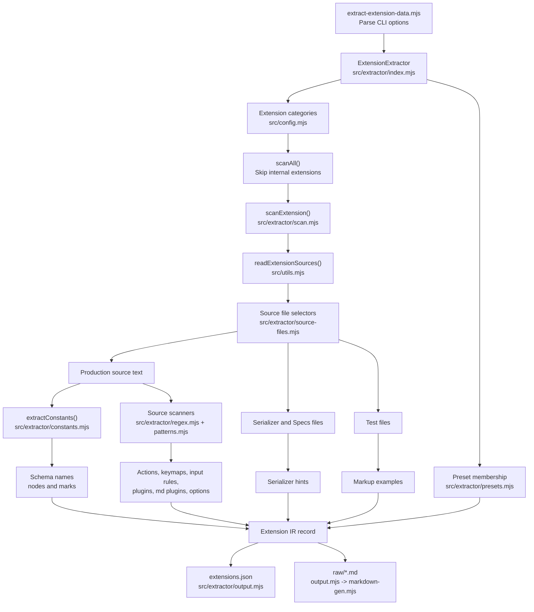

# Extension Extraction Pipeline

The extractor keeps orchestration and parsing separate:

- `index.mjs` decides which extension directories are scanned and when output is written.
- `scan.mjs` builds one extension record from source files and parser results.
- `source-files.mjs` owns file selection rules.
- `regex.mjs`, `constants.mjs`, and `patterns.mjs` own source parsing details.
- `output.mjs` and `markdown-gen.mjs` own generated artifacts.
