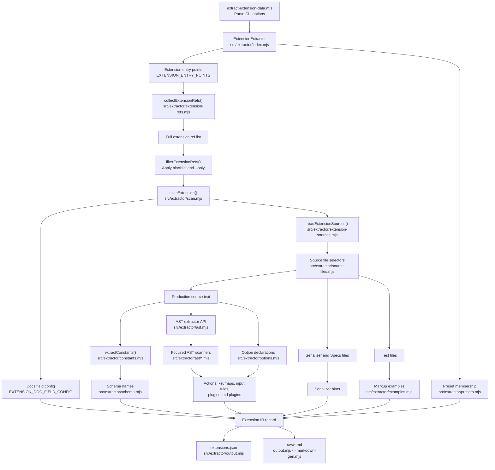

# Extension Extraction Pipeline

The extractor keeps orchestration and parsing separate:

- `index.mjs` asks `extension-refs.mjs` to collect all configured extension entry points,
  filters them by blacklist and `--only`, and only then scans each remaining extension.
- `scan.mjs` coordinates one extension scan; `extension-sources.mjs`, `schema.mjs`, and `record-fields.mjs` own the focused extraction steps.
- `source-files.mjs` owns file selection rules.
- `ast.mjs` exposes focused AST scanners from `ast/*.mjs`; `options.mjs`, `examples.mjs`, and `constants.mjs` own their TypeScript AST parsing details.
- `output.mjs` and `markdown-gen.mjs` own generated artifacts.
