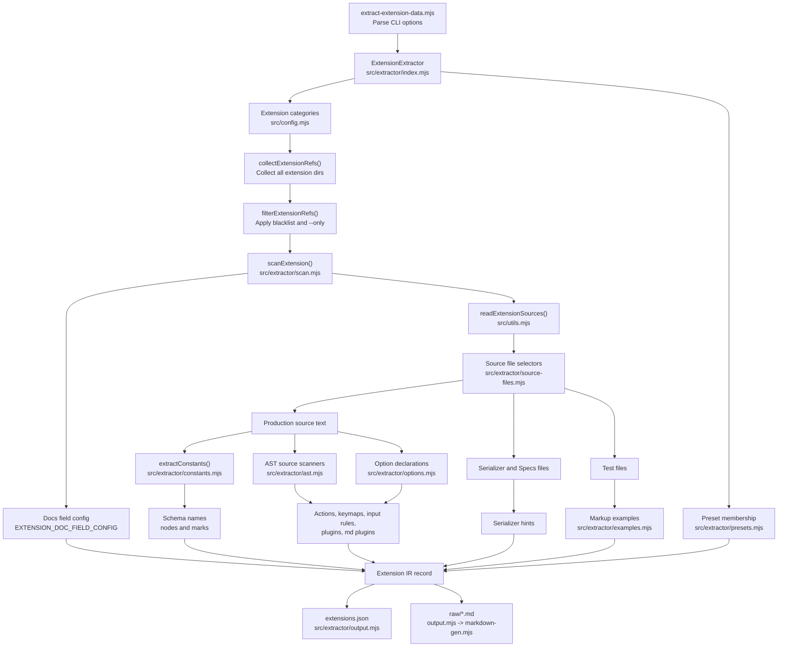

# Extension Extraction Pipeline

The extractor keeps orchestration and parsing separate:

- `index.mjs` collects all extension directories, filters them by blacklist and `--only`, and decides when output is written.
- `scan.mjs` builds one extension record from source files and parser results.
- `source-files.mjs` owns file selection rules.
- `ast.mjs`, `options.mjs`, `examples.mjs`, and `constants.mjs` own TypeScript AST parsing details.
- `output.mjs` and `markdown-gen.mjs` own generated artifacts.
