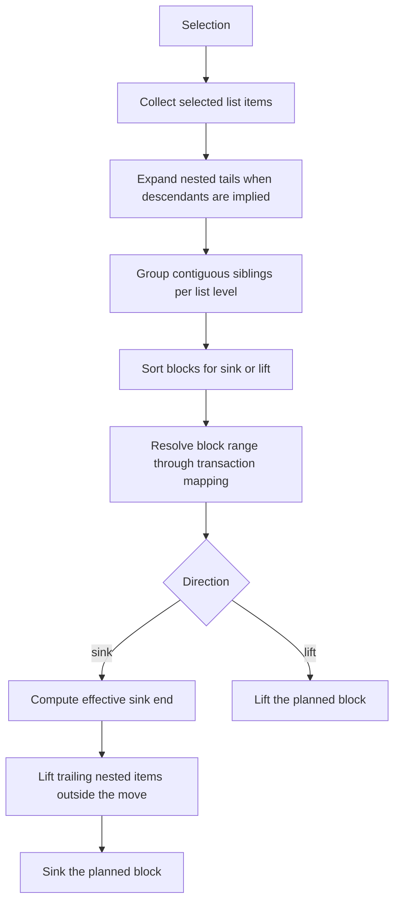

# Lists Selection Planner

This extension handles multi-item list indent and outdent through a shared block planner.
The planner does not move every selected row independently. Instead, it:

1. Collects the selected `list_item` nodes touched by the current selection.
2. Expands nested tails when the selected structure implies additional descendant items.
3. Groups the expanded items into contiguous sibling blocks per list level.
4. Executes those blocks in a direction-specific order for `sink` and `lift`.

## Covered Cases

1. A single selected list item.
2. A flat sibling group on one list level.
3. A downward staircase selection into deeper nested items.
4. An upward staircase selection from nested items back to outer siblings.
5. A mixed multi-level selection that requires planner expansion and regrouping.
6. A multi-block command that stays in one transaction and preserves selection on undo.

## Algorithm

